# 소프트웨어 엔지니어링과 LLM 평가
## 코딩 벤치마크의 변천사, 그리고 남겨진 과제

<p class="title-meta">Curt Park</p>

<!--
1시간 발표. SE 분야에서 LLM을 어떻게 평가하는지, 코딩 벤치마크가 어떻게 진화해왔고 어떤 한계가 남아있는지 논문 데이터를 기반으로 살펴봅니다.
-->

---

# Agenda

<ol class="agenda-list">
<br>
  <li>소프트웨어 엔지니어링과 코딩 벤치마크</li>
  <li>HumanEval: LLM 코딩 벤치마크의 조상님</li>
  <li>SWE-bench: 실전 난이도의 문제</li>
  <li>SWE-bench-Verified: 더 나은 품질</li>
  <li>Multi-SWE-bench: 다언어 확장</li>
  <li>The SWE-Bench illusion: 오염 문제</li>
  <li>SWE-rebench: 오염 문제 대응 전략1 - 지속적 갱신</li>
  <li>SWE-bench Pro: 오염 문제 대응 전략2 - 접근 제한</li>
  <li>남은 과제</li>
  <li>의견 나누기</li>
</ol>

<!--
총 10개 항목으로 구성. 소프트웨어 엔지니어링 분야에서 LLM 평가의 큰 그림을 먼저 잡고, 코딩 벤치마크의 계보를 시간순으로 따라가며 각 단계의 동기와 한계를 분석합니다.
-->

---

# 오늘 발표에서

<br>
<div class="grid grid-cols-2 gap-8">
<div>

### 다루는 것
- SWE 분야에서의 LLM 활용
- SWE 벤치마크의 계보
- SWE 벤치마크의 한계

</div>
<div>

### 다루지 않는 것
- 모델 성능 개선
- 에이전트 하네스 (스캐폴딩)

</div>
</div>

<!--
발표의 목적을 명확히 합니다. 우리는 개별 모델이 얼마나 뛰어난지를 보는 게 아니라, "평가 방법" 자체를 분석합니다.
-->

---

# 최신 모델 발표와 벤치마크

<p class="chart-note">최신 모델의 성능비교에 반드시 등장하는 벤치마크</p>

<div class="grid grid-cols-2 gap-6">
<div>

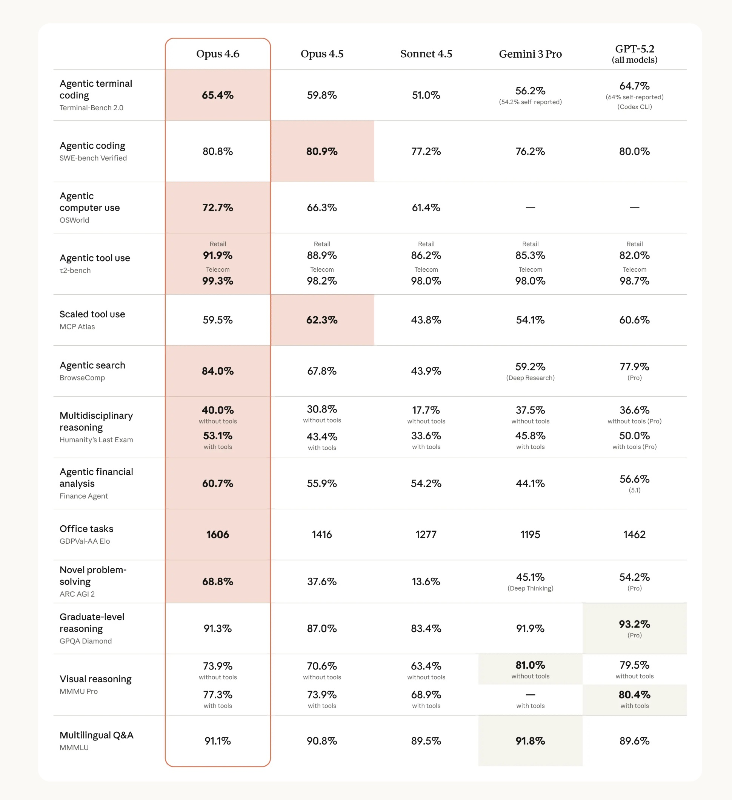
<p class="source" style="text-align: center">Anthropic — Claude Opus 4.6 발표 (2025)</p>

</div>
<div>

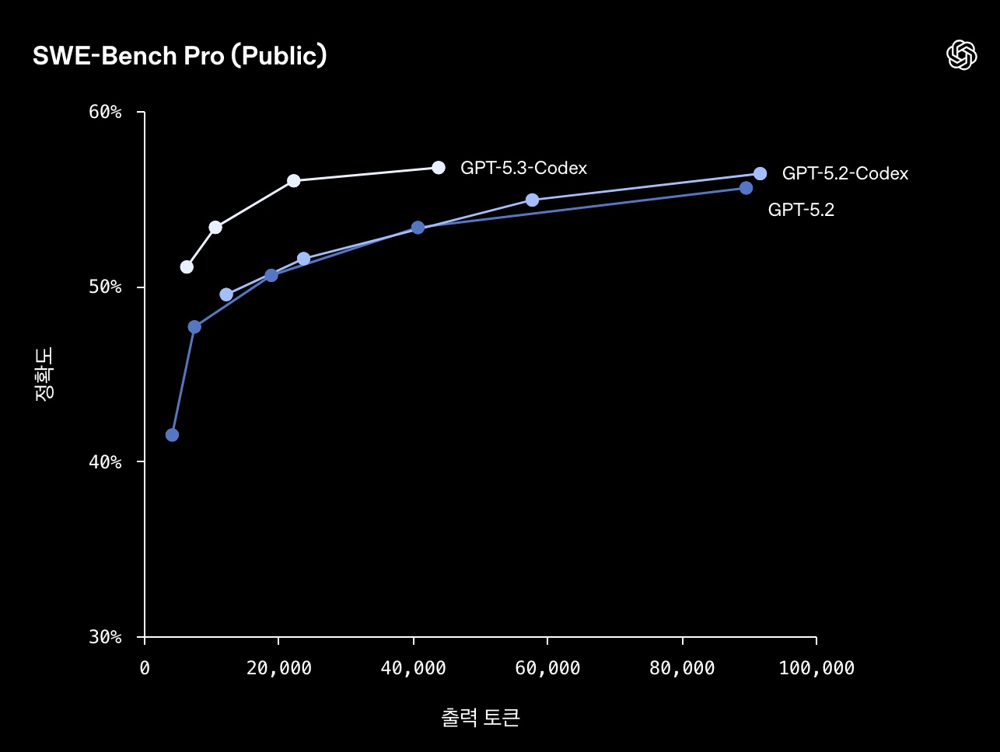
<p class="source" style="text-align: center">OpenAI — GPT-5.3-Codex 발표 (2025)</p>

</div>
</div>

<p class="emphasis">SWE-bench Verified, SWE-bench Pro… "SWE"가 눈에 띈다</p>

<!--
최신 모델 발표를 보면 반드시 코딩 벤치마크 점수가 있습니다. 특히 "SWE" prefix가 붙은 벤치마크들이 두드러집니다. 이 벤치마크들은 무엇이고, 왜 이렇게 중요하게 다루어지는 걸까요?
-->

---

# "Coding = Software Engineering?"

<br>

<div class="grid grid-cols-2 gap-8">
<div>

### 대표적인 Agentic Coding 벤치마크들...
- **SWE**-bench
- **SWE**-bench Verified
- **SWE**-bench Pro
- **SWE**-bench Live
- **SWE**-rebench
- Multi-**SWE**-bench

</div>
<div>

### 그렇다면...

<div class="highlight-box warning" style="margin-top: 1em">

코딩(Coding)이 곧<br>
소프트웨어 엔지니어링(SWE)일까?

</div>

</div>
</div>

<p class="emphasis">→ 소프트웨어 엔지니어링이 무엇인지 먼저 짚고 넘어가보자</p>

<!--
"SWE" prefix가 넘쳐나는 상황. 코딩 능력이 곧 소프트웨어 엔지니어링 능력인가? 이 질문에 답하기 위해 SE의 정의부터 살펴봅니다.
-->

---

# 소프트웨어 엔지니어링이란?

<br>

<div class="grid grid-cols-2 gap-6">
<div>

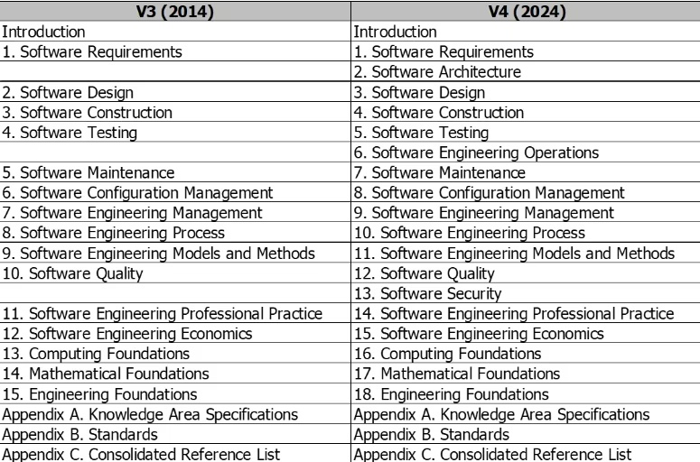
<p class="source" style="text-align: center">Bourque & Fairley (eds.), SWEBOK V4, IEEE, 2024</p>

</div>

<div class="swebok-grid" style="font-size: 0.7em">
  <div class="swebok-item covered">소프트웨어 구현</div>
  <div class="swebok-item covered">소프트웨어 테스팅</div>
  <div class="swebok-item covered">소프트웨어 유지보수</div>
  <div class="swebok-item covered">소프트웨어 보안</div>
  <div class="swebok-item covered">요구사항 공학</div>
  <div class="swebok-item covered">소프트웨어 설계</div>
  <div class="swebok-item covered">소프트웨어 아키텍처</div>
  <div class="swebok-item covered">형상 관리</div>
  <div class="swebok-item covered">소프트웨어 품질</div>
  <div class="swebok-item covered">SE 운영</div>
  <div class="swebok-item covered">SE 관리</div>
  <div class="swebok-item covered">SE 프로세스</div>
  <div class="swebok-item covered">SE 모델/방법론</div>
  <div class="swebok-item covered">SE 전문실무</div>
  <div class="swebok-item covered">SE 경제학</div>
  <div class="swebok-item covered">컴퓨팅 기초</div>
  <div class="swebok-item covered">수학 기초</div>
  <div class="swebok-item covered">공학 기초</div>
</div>

</div>

<!--
SWEBOK V4 기준 18개 지식 영역. 현재 벤치마크가 커버하는 것은 구현과 테스팅, 그리고 유지보수와 보안의 일부뿐입니다.
-->

---

# 소프트웨어 엔지니어링 벤치마크 분포

<p class="chart-note">소프트웨어 엔지니어링 벤치마크 291개를 분석해보니, 무려 43%가 코딩!</p>

<div style="display: flex; flex-direction: column; align-items: center; gap: 0.5em">
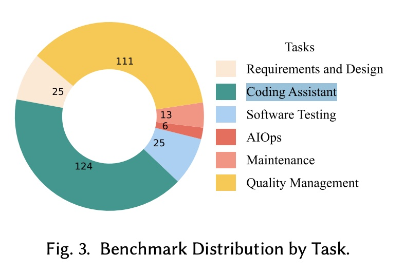
<p class="source">Source: Hu et al., "Assessing and Advancing Benchmarks for Evaluating LLMs in SE Tasks," arXiv:2505.08903, 2025</p>
</div>

<!--
SE 전체 291개 벤치마크 중 코딩이 43%로 가장 많습니다. 요구사항 공학, 설계, 프로젝트 관리 등은 10% 미만으로, 정량적 자동 평가가 어려운 영역입니다.
-->

---

# 왜 이렇게 치우쳐져 있을까?

<div class="grid grid-cols-2 gap-8">
<div>

<br>

### 정량 평가 & 자동화의 난이도

<br>

| SE 영역 | 정답 판별 방법 | 자동화 |
|---------|-------------|--------|
| 코딩 | 테스트 실행 | ✅ 쉬움 |
| 테스팅 | 커버리지/버그 탐지 | ⚠️ 부분 |
| 요구사항 | 전문가 판단 필요 | ❌ 어려움 |
| 설계/아키텍처 | 주관적 기준 | ❌ 어려움 |
| 프로젝트 관리 | 성과 지표 다양 | ❌ 어려움 |

</div>
<div>

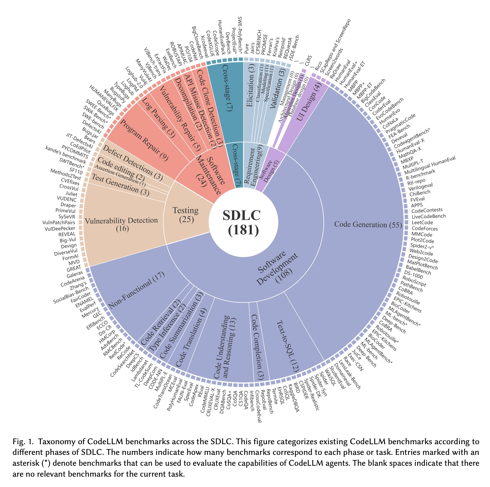
<p class="source" style="text-align: center">Wang et al., SDLC Taxonomy, arXiv:2505.05283, 2025</p>

</div>
</div>

<!--
코딩 벤치마크가 압도적으로 많은 이유는 단순합니다. 코드는 실행해서 테스트를 통과하면 정답이라는 명확한 기준이 있습니다. 요구사항이나 설계 품질을 자동으로 평가하는 것은 훨씬 어렵습니다.
-->

---
layout: center
---

# 오늘은 코딩 벤치마크에 집중합니다

<!--
오늘은 코딩 벤치마크로 범위를 제한합니다. 하지만 이 한계를 인지한 채로 발표를 진행합니다. 발표 내내 "이 점수가 실제로 무엇을 측정하는가"라는 질문을 유지해주세요.
-->

---
layout: section
---

# HumanEval
## LLM 코딩 벤치마크의 조상님 (2021)

---

# 배경: BLEU 점수의 한계

<br>
<div class="grid grid-cols-2 gap-8">
<div>

### 기존 평가의 문제
- 코드 평가에 **BLEU 점수** 사용
- **BLEU** (Bilingual Evaluation Understudy):<br>n-gram 중복 기반 텍스트 유사도 메트릭.<br>기계번역 평가용으로 설계됨.
- 실제로 실행되는지는 무관

</div>
<div>

### 왜 BLEU로는 부족한가?

```python
# 정답
def add(a, b): return a + b

# BLEU 높지만 틀린 코드
def add(a, b): return a - b

# BLEU 낮지만 맞는 코드
def sum_two(x, y): return x + y
```

</div>
</div>

<p class="emphasis">→ 기능적 정확성(functional correctness)을 직접 측정해야 한다</p>

<!--
HumanEval 이전에는 BLEU 점수로 코드 생성 모델을 평가했습니다. BLEU는 기계번역을 위해 설계된 지표로, 코드에서는 의미적으로 동일한 코드가 텍스트적으로 완전히 달리 쓰일 수 있습니다. 반대로 텍스트는 비슷하지만 버그가 있는 코드도 높은 점수를 받을 수 있습니다. OpenAI Codex 팀이 이 문제를 해결하려고 HumanEval을 만들었습니다.
-->

---

# HumanEval이란?

<div class="grid grid-cols-2 gap-8">
<div>

### 문제 예시

```python
def has_close_elements(
    numbers: List[float],
    threshold: float
) -> bool:
    """ Check if in given list of numbers,
    are any two numbers closer to each other
    than given threshold.
    >>> has_close_elements([1.0, 2.0, 3.0], 0.5)
    False
    >>> has_close_elements([1.0, 2.8, 3.0], 0.3)
    True
    """
```

164개 Python 문제 · GitHub 코드 **제외** · 평균 **7.7**개 유닛 테스트

</div>
<div>

### 평가 메트릭: pass@k

$$\text{pass@k} = 1 - \frac{\binom{n-c}{k}}{\binom{n}{k}}$$

n개 샘플 중 c개가 정답일 때,<br>k개를 무작위로 뽑았을 때<br>**전부 오답일 확률을 1에서 뺀 것**

<hr>

- **pass@1**: 1개 생성해서 맞출 확률<br><span class="small">→ 실용적 지표 (사용자는 보통 첫 응답을 씀)</span>
- **pass@100**: 100개 중 하나라도 맞을 확률<br><span class="small">→ 모델의 잠재력 상한선</span>

</div>
</div>

<!--
HumanEval의 핵심 설계 원칙:
1. 수작업 제작: GitHub 코드를 그대로 가져온 게 아니라 직접 작성. 훈련 데이터 오염을 방지하기 위함입니다.
2. pass@k 메트릭: 단순히 k개 중 하나라도 맞으면 성공이라는 naive한 방식은 분산이 크기 때문에, 편향되지 않은 추정량 공식을 사용합니다.
3. 평균 7.7개 테스트: 하나의 문제당 다양한 엣지 케이스를 커버해서 우연한 통과를 방지합니다.

Codex 초기 결과: pass@1 28.8%, pass@100 72.3% → 반복 샘플링 전략의 유효성을 보여줍니다.
-->

---

# HumanEval 성능 추이

<p class="chart-note">pass@1 (%) — 4년간의 진화</p>

<ChartHumanEval />

<p class="source">
Codex 28.8%: Chen et al. 2021 · code-davinci 47.0%: CodeT (Chen et al. 2022) · GPT-4 67.0%: OpenAI Technical Report 2023 · GPT-4o 90.2%: OpenAI simple-evals · Claude 3 Opus 84.9%: Anthropic Model Card 2024 · Llama 3.1 89.0%: Meta AI Blog 2024 · o1 96.3%: EvalPlus Leaderboard / o1 System Card 2024
</p>

<!--
2021년 Codex 28.8%에서 시작해 불과 4년 만에 96.3%까지 도달. 이 속도는 놀랍지만, 동시에 벤치마크가 사실상 포화 상태에 이르렀음을 의미합니다.

o1은 2024년 9월 출시되었습니다.
-->

---

# 벤치마크 포화의 증거

<div class="highlight-box warning">

### 변형 태스크에서의 성능 하락
Top 모델들이 HumanEval 원본에서는 90%+ 달성하지만,
변형된 태스크에서는 **<span class="red">19.6 ~ 47.7%p</span>** 하락

</div>

EvoEval의 **7가지 변형** 예시:
- 함수 이름 변경 (e.g., `has_close_elements` → `check_proximity`)
- 입출력 형식 뒤집기 (반환 타입 변경)
- 함수 합성 (두 함수를 하나로 합침)
- 맥락·도메인 교체 (숫자 → 문자열 문제로)

→ 문제의 본질은 같지만 **표현만 바뀌었을 때 풀지 못한다**<br>
→ 진짜 이해가 아니라 **패턴 암기**에 의존한다는 증거

<p class="source">
Xia, Deng, Zhang, "EvoEval: Evolving Coding Benchmarks via LLM," COLM 2024, arXiv:2403.19114 — HumanEval 164문제를 7가지 방식으로 변형
</p>

<!--
포화의 원인: 진짜 능력 향상도 있지만, HumanEval 문제들이 인터넷에 공개되어 훈련 데이터에 포함된 암기/오염도 존재합니다.

EvoEval: HumanEval 원본 문제를 7가지 방식으로 LLM이 변형 → 표현만 달라졌는데 성능이 급락 → 모델이 문제의 의미를 이해하는 게 아니라 형태를 암기하는 경향.
-->

---

# HumanEval의 핵심 한계

<div class="highlight-box danger">

### 실제 소프트웨어 엔지니어링 문제는 훨씬 더 복잡하다

</div>

<div class="grid grid-cols-2 gap-8">
<div>

### HumanEval이 가정하는 세계
- 독립적인 함수 한 개
- 명확한 입출력 명세
- 빈 컨텍스트에서 시작

</div>
<div>

### 현실 세계의 소프트웨어 개발
- **여러 파일, 모듈, 클래스**가 얽힌 대규모 코드베이스
- 기존 구현·테스트·문서 등 **프로젝트 전체 맥락** 이해 필요
- GitHub 이슈를 읽고 버그를 **재현**하고, 기존 **테스트 스위트**를 통과시켜야

</div>
</div>

<p class="emphasis">→ 단일 함수 작성 능력 ≠ 소프트웨어 엔지니어링 능력</p>

<!--
HumanEval의 가장 큰 한계는 "실제 소프트웨어 개발"을 반영하지 않는다는 점입니다.

부수적 한계:
- Python 단일 언어만 지원 (164개 문제)
- 현대 모델 90%+ 도달 → 차별화 불가
- 진짜 이해보다 패턴 암기에 의존 가능

이 한계들이 SWE-bench 등장의 동기가 됩니다.
-->

---
layout: section
---

# SWE-bench: 실전 난이도의 문제

<p class="section-subtitle">실제 GitHub 이슈 기반 평가 (2023)</p>

---

# SWE-bench란?

<p class="source">Jimenez et al., Princeton NLP — ICLR 2024 Oral, arXiv:2310.06770</p>

<div class="grid grid-cols-2 gap-8">
<div>

### 핵심 아이디어
유명 GitHub 레포에 제출된<br>**이슈(버그 리포트 / 기능 요청) 해결**이 목표

<div class="highlight-box info" style="margin-top: 1em">

**GitHub PR = 자연발생적 벤치마크**<br>
이슈 → 코드 수정 → 테스트 통과의<br>흐름이 이미 존재한다

</div>

</div>
<div>

### 규모와 성능

<div class="stat-grid" style="grid-template-columns: repeat(2, 1fr); gap: 0.5em; margin-top: 0.5em">
  <div class="stat-card">
    <div class="stat-number" style="font-size: 1.5em">12</div>
    <div class="stat-label">인기 Python<br>오픈소스 레포</div>
  </div>
  <div class="stat-card">
    <div class="stat-number" style="font-size: 1.5em">2,294</div>
    <div class="stat-label">이슈–PR 쌍</div>
  </div>
</div>

<div class="highlight-box danger" style="margin-top: 0.5em; font-size: 0.85em">

BM25 retriever + Claude 2로<br>단 **1.96%**만 해결

</div>

</div>
</div>

<!--
SWE-bench의 핵심 아이디어는 "이미 존재하는 데이터를 활용하자"는 것입니다. GitHub의 실제 PR들은 (1) 문제 설명(이슈), (2) 해결책(코드 수정), (3) 검증(테스트)이 자연스럽게 붙어있습니다.

Princeton NLP 그룹이 2023년에 발표했으며 ICLR 2024 Oral 채택됩니다.
-->

---

# SWE-bench 구축: 3단계 파이프라인

<div class="grid grid-cols-2 gap-6">
<div>

### ~90,000 → 2,294 생존

**Stage 1: PR 수집**
- 12개 인기 레포에서 ~90,000 PR 수집

**Stage 2: Attribute-based filtering**
- GitHub 이슈와 연결된 PR
- 테스트 파일 수정 포함

**Stage 3: Execution-based filtering**
- 패치 적용 전 테스트 **실패**
- 패치 적용 후 테스트 **통과**
- 환경 오류 없음

</div>
<div>

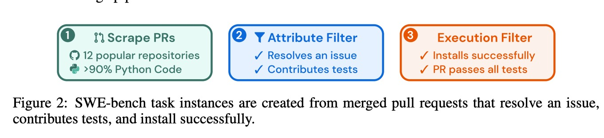

</div>
</div>

<p class="source">12개 레포: Django(850), sympy(386), scikit-learn(229), sphinx(187), matplotlib(184) 등</p>

<!--
구축 파이프라인의 핵심:
1. 필터링: 90,000개 PR 중 2,294개만 통과. 가장 중요한 조건은 "테스트 파일 수정 포함"입니다. 이 조건이 있어야 실행 기반 평가가 가능합니다.
2. Execution-based filtering: 실제로 실행해서 fail→pass 전환을 확인합니다.
3. 결과: ~90,000 PR에서 2,294개(약 2.5%)만 최종 생존.
-->

---

# SWE-bench 태스크와 평가 방법

<div class="grid grid-cols-2 gap-6">
<div>

### 태스크 구성
- **Input**: 이슈 텍스트 + 코드베이스<br><span class="small">(BM25로 관련 파일 선별하여 컨텍스트 구성)</span>
- **Output**: 패치 파일 (diff 형식)

<br>

### 평가 기준
1. 패치 적용
2. **fail-to-pass** 테스트 통과 (새로 추가된 테스트)
3. **pass-to-pass** 테스트 유지 (기존 테스트 회귀 없음)
4. 둘 다 통과 → "resolved"

$$\text{resolve rate} = \frac{\text{해결된 인스턴스}}{\text{전체 인스턴스}}$$

</div>
<div>

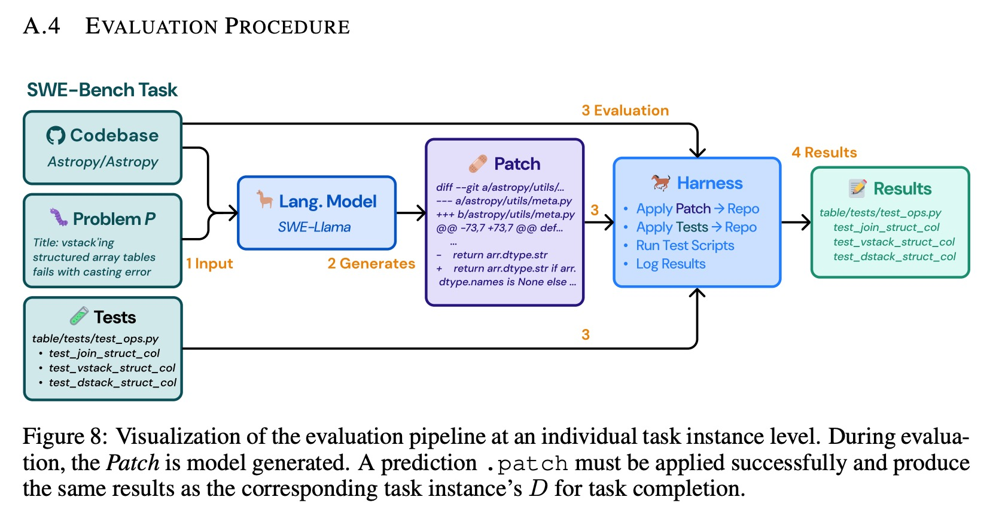

</div>
</div>

<!--
평가의 핵심: 단순히 코드가 실행되는지가 아니라, 이슈가 제기한 버그/기능을 정확히 해결했는지를 테스트로 확인합니다. pass-to-pass 조건이 중요한 이유는 기존 기능을 깨지 않아야 하기 때문입니다.
-->

---

# SWE-bench 데이터 특성

<br>
<div class="grid grid-cols-2 gap-6">
<div>

### 패치 통계
- 평균 **1.7개** 파일 수정
- 평균 **3.0개** 함수 수정
- 평균 **32.8줄** 변경
- 이슈 설명 평균 **195단어**
- pass-to-pass 테스트 중간값 **51개**

<br>

</div>
<div>

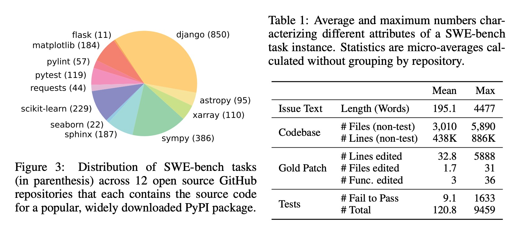

<p class="source" style="text-align:center">레포별 인스턴스 분포</p>

</div>
</div>

<!--
데이터 특성이 중요한 이유: 평균 32.8줄 수정은 HumanEval의 짧은 함수와 완전히 다른 차원입니다. 멀티모달 이슈의 존재도 흥미롭습니다 - 텍스트만으로는 이슈를 완전히 이해할 수 없는 경우가 있습니다.
-->

---

# SWE-bench 초기 결과

<div class="grid grid-cols-2 gap-8">
<div>

### 논문 발표 당시 성능

<div class="stat-grid" style="grid-template-columns: repeat(2, 1fr); gap: 0.5em">
  <div class="stat-card red">
    <div class="stat-number" style="font-size: 1.4em">1.96%</div>
    <div class="stat-label">Claude 2<br>BM25 13k</div>
  </div>
  <div class="stat-card yellow">
    <div class="stat-number" style="font-size: 1.4em">~5%</div>
    <div class="stat-label">Oracle retrieval<br>(정답 파일 제공 시)</div>
  </div>
</div>

<p class="emphasis" style="margin-top: 0.5em">HumanEval 84% 달성 모델이<br>SWE-bench에서는 2% 미만</p>

</div>
<div>

### 컨텍스트 길이와 성능
- BM25 컨텍스트가 길어질수록 성능 **하락**
- Oracle-collapsed<br><span class="small">(수정 라인 ±15줄만 제공):</span><br>
  Claude 2: 4.8% → 5.9%<br>
  GPT-4: 1.3% → 3.4%
- → 긴 컨텍스트 처리 능력이 핵심 병목

</div>
</div>

<!--
초기 결과가 충격적이었던 이유: HumanEval 84% Claude 2가 SWE-bench에서 1.96%는 두 벤치마크가 근본적으로 다른 능력을 측정한다는 증거입니다.

Oracle-collapsed 실험: 정답 파일의 수정된 줄 ±15줄만 컨텍스트로 줬을 때 성능이 올라갑니다 → 문제는 "코드 수정 능력"이 아니라 "어디를 수정해야 하는지 찾는 능력"임을 시사합니다.

기여: 1) 최초의 실제 GitHub 이슈 기반 벤치마크, 2) 2,294개 태스크 + Docker 환경, 3) SWE-Llama 파인튜닝 베이스라인
-->

---

# SWE-bench의 품질 문제

- 2,294개 중 상당수가 **모호**하거나 **불명확**
- 테스트 사양이 불충분한 경우 존재
- 올바른 솔루션도 테스트 실패 가능
- 벤치마크 자체의 신뢰성 의문 제기

<div class="highlight-box warning">

실제로 발견된 문제들:
- 이슈 설명이 불완전해 PR 토론 내용까지 읽어야 이해 가능
- 테스트가 특정 에러 메시지 문자열을 검사하는 등 과도하게 구체적
- Deprecated API 사용 방식 등 암묵적 맥락 누락

</div>

<p class="emphasis">→ 품질 검증된 부분집합이 필요하다</p>

---
layout: section
---

# SWE-bench Verified: 더 나은 품질

<p class="section-subtitle">전문가 검증 부분집합 (2024)</p>

---

# 왜 Verified가 필요했나

<p class="source">OpenAI Preparedness Team, 2024</p>

<div class="grid grid-cols-3 gap-4" style="font-size: 0.85em">
<div>

<div class="highlight-box danger">

### Overly Specific Tests
테스트가 너무 구체적이거나<br>이슈와 무관한 내용을 검사

<hr>

<p class="small">예: 특정 에러 메시지 문자열 일치 검사 → 논리는 맞지만 메시지가 다르면 실패</p>

</div>

</div>
<div>

<div class="highlight-box danger">

### Underspecified Issues
이슈 설명이 모호해서<br>무엇을 해결해야 하는지 불명확

<hr>

<p class="small">예: PR 토론 맥락 없이는 이슈 본문만으로 해결책을 특정할 수 없음</p>

</div>

</div>
<div>

<div class="highlight-box danger">

### Environment Setup
환경 설정 문제로<br>올바른 솔루션도 실패

<hr>

<p class="small">예: Deprecated API, 암묵적 의존성 버전 가정</p>

</div>

</div>
</div>

<div class="highlight-box warning" style="margin-top: 0.8em">

**68.3% 필터링** → 원본 SWE-bench 점수가 실제 능력보다 **낮게** 측정되었을 가능성

</div>

<!--
OpenAI Preparedness Team이 원본 SWE-bench를 직접 검토하면서 발견한 세 가지 핵심 문제입니다. 이 문제들은 모두 "올바른 솔루션이 테스트를 통과하지 못하는" 방향으로 작용합니다 → 모델 성능이 실제보다 낮게 측정됩니다.
-->

---

# SWE-bench Verified 어노테이션

<div class="grid grid-cols-2 gap-8">
<div>

### 전문가 검증 프로세스
- Upwork 모집 **93**명 전문 Python 개발자
- **1,699**개 샘플 수동 평가
- **3중 교차 검증**으로 신뢰도 확보
- 0~3점 심각도 스케일로 평가

### 평가 기준
- **이슈 명확도**: 이슈만 보고 해결책을 특정할 수 있는가?
- **테스트 공정성**: 올바른 솔루션이 테스트를 통과하는가?

</div>
<div>

### 필터링 결과

| 문제 유형 | 비율 |
|----------|------|
| 불명확한 이슈 설명 | **38.3%** |
| 부당한 테스트 케이스 | **61.1%** |
| 전체 제거 비율 | **68.3%** |
| **최종 선정** | **500개** |

<div class="highlight-box info" style="margin-top: 0.5em; font-size: 0.85em">

난이도: Easy(≤15분) 196개 / Hard(≥1시간) 45개

</div>

</div>
</div>

<!--
93명 어노테이터가 1,699개를 평가해서 500개를 골랐습니다. 68.3% 필터링은 충격적인 수치입니다 - 원본 SWE-bench의 2/3 이상이 어떤 형태로든 품질 문제가 있다는 것을 의미합니다.
-->

---

# SWE-bench Verified: Docker 평가 인프라

<br>

<div class="stat-grid" style="grid-template-columns: repeat(2, 1fr); gap: 0.5em">
  <div class="stat-card">
    <div class="stat-number" style="font-size: 1.5em">500</div>
    <div class="stat-label">최종 인스턴스</div>
  </div>
  <div class="stat-card">
    <div class="stat-number" style="font-size: 1.5em">93</div>
    <div class="stat-label">어노테이터</div>
  </div>
  <div class="stat-card">
    <div class="stat-number" style="font-size: 1.5em">33.2%</div>
    <div class="stat-label">공개 당시<br>최고 성능(GPT-4o)</div>
  </div>
  <div class="stat-card">
    <div class="stat-number" style="font-size: 1.5em">80%+</div>
    <div class="stat-label">1년 반 후<br>최고 성능</div>
  </div>
</div>

<br>

<div class="grid grid-cols-2 gap-8">
<div>

### 재현 가능한 평가 환경
- SWE-bench 원저자와 협력하여<br>**컨테이너화된 Docker 환경** 구축
- 기존 평가의 **재현성 문제 해결**
- 각 인스턴스별 **독립 환경**으로 의존성 충돌 방지

</div>

<div>

### 표준화된 평가
- 모든 모델이 동일한 환경에서 평가
- 평가 결과의 공정성 및 일관성 보장
- 커뮤니티 표준 벤치마크로 자리잡음

</div>
</div>


<!--
Docker 환경 표준화는 단순한 기술적 개선이 아닙니다. 이전에는 각 팀이 서로 다른 환경에서 평가했기 때문에 결과를 비교하기 어려웠습니다. Verified의 Docker 인프라가 커뮤니티 표준으로 자리잡으면서 공정한 비교가 가능해졌습니다.
-->

---

# SWE-bench Verified 리더보드

<p class="chart-note">해결률 (%) — 2026년 2월 기준</p>

<ChartSWEVerified />

<!--
Verified에서는 상위 모델이 80%를 돌파. Full에서 20%였던 것과 극적인 대비. Verified 기준으로 모델 간 차이가 더 잘 드러납니다.

주목할 점: 2024년 8월 공개 당시 최고 성능이 33.2%(GPT-4o)였는데, 1년 반 만에 80%를 넘겼습니다. 이 속도가 실제 능력 향상인지, 아니면 오염/과적합인지가 논쟁의 핵심입니다.
-->

---

# SWE-bench의 한계
<br>
<div class="highlight-box warning">

### Python Only
12개 레포 모두 Python<br>
실제 소프트웨어 세계는 다양한 언어로 구성

</div>

<div class="highlight-box warning">

### 정적 스냅샷
한번 수집 후 업데이트 없음 → 오염 누적<br>
모든 주요 LLM의 훈련 데이터 컷오프 이전 이슈들

</div>

---
layout: section
---

# Multi-SWE-bench: 다언어 확장

<p class="section-subtitle">Python 편향을 넘어서 (2025)</p>

---

# Multi-SWE-bench: 왜 필요한가?

<div class="grid grid-cols-2 gap-8">
<div>

### SWE-bench/Verified의 한계
- Python **전용** — 7개 언어의 특성 무시
- Python 특화 에이전트를 그대로 다른 언어에 적용

<br>

### 언어별 고유 특성
| 차원 | 예시 |
|------|------|
| 패러다임 | OOP / 함수형 / 절차적 |
| 타입 시스템 | 정적(Java, Rust) / 동적(JS, Python) |
| 메모리 관리 | GC / 소유권(Rust) / 수동(C) |
| 실행 모델 | 컴파일 / 인터프리터 / JIT |

</div>
<div>

<div class="highlight-box danger">

### 핵심 질문
Python에서 훈련·최적화된 에이전트를<br>
**7개 언어로 일반화**할 수 있는가?

</div>

<div class="highlight-box info" style="margin-top: 1em">

실제 개발 환경은 다양한 언어로 구성되어 있습니다. Python 점수로 "코딩 능력"을 일반화하는 것은 위험할 수 있다.

</div>

</div>
</div>

<!--
SWE-bench/Verified의 Python 전용 한계가 왜 문제인지: 실제 산업 환경은 Java(백엔드), TypeScript(프론트엔드), Go(인프라), Rust(시스템) 등 다양한 언어가 공존합니다. Python 편향 평가로는 LLM의 실제 범용 코딩 능력을 측정할 수 없습니다.
-->

---

# Multi-SWE-bench: 개요와 기여

<p class="source">Zan et al., ByteDance Seed — NeurIPS 2025 Datasets & Benchmarks, arXiv:2504.02605</p>

<div class="stat-grid">
  <div class="stat-card">
    <div class="stat-number">7</div>
    <div class="stat-label">지원 언어<br>Java·TS·JS·Go·Rust·C·C++</div>
  </div>
  <div class="stat-card">
    <div class="stat-number">39</div>
    <div class="stat-label">레포지토리</div>
  </div>
  <div class="stat-card">
    <div class="stat-number">1,632</div>
    <div class="stat-label">최종 인스턴스<br>(2,456개 후보에서 선별)</div>
  </div>
  <div class="stat-card">
    <div class="stat-number">68</div>
    <div class="stat-label">전문 어노테이터<br>(언어별 80%+ 정확도)</div>
  </div>
</div>

### 핵심 기여
- **9개 LLM × 3개 방법** 대규모 실증 평가 (GPT-4o, o1, o3-mini, Claude 3.5/3.7, DeepSeek-V3/R1 등)
- **Multi-SWE-RL**: 76개 레포, 7개 언어, **4,723개** 컨테이너화 인스턴스 (RL 훈련용 별도 제공)

<!--
Multi-SWE-bench가 단순 벤치마크를 넘어선 이유: Multi-SWE-RL이라는 RL 훈련 데이터셋도 함께 제공하여 커뮤니티가 다언어 에이전트를 학습할 수 있도록 했습니다.
-->

---

# Multi-SWE-bench: 5단계 구축 파이프라인
<br>
<div class="grid grid-cols-2 gap-6">
<div style="font-size: 0.8em">

**Phase 1: 레포 선별**
GitHub 스타 500+, CI/CD 설정 필수, 클린 빌드 가능

**Phase 2: PR 수집**
이슈 연결 + 테스트 수정 + 메인 병합 조건

**Phase 3: 환경 결정**
Docker 기반 격리 환경, 의존성 자동 수집, 빌드 실패 시 자동 수정 시도

**Phase 4: PR 필터링**
PASSED/FAILED/NONE/SKIPPED 상태전이 분석<br>
→ **2,456개** 후보

**Phase 5: 수동 검증**
68명 어노테이터, 2인 독립 레이블링, 14명 내부 QA팀<br>
필터링 공식: `Q2.1=0 AND Q3.1∈{2,3} AND Q4.1∈{2,3}`<br>
→ **1,632개** 최종

</div>
<div>

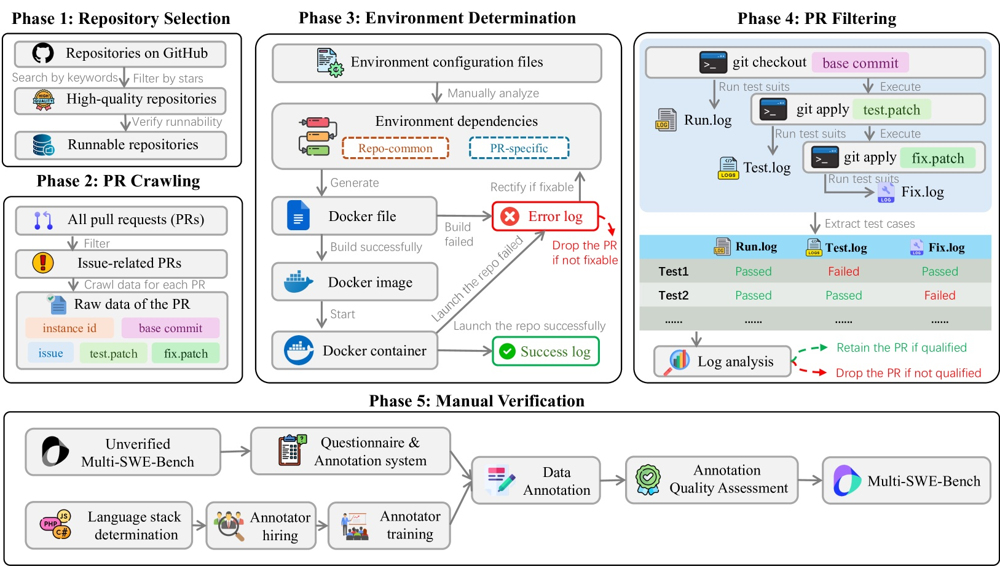

</div>
</div>

<!--
SWE-bench 대비 더 정교한 필터링: SWE-bench는 단순히 테스트 파일 수정 여부를 확인했지만, Multi-SWE-bench는 PASSED/FAILED/NONE/SKIPPED 상태전이를 정밀 분석합니다. 또한 2인 독립 레이블링 + 14명 내부 QA팀으로 품질을 보장합니다.
-->

---

# Multi-SWE-bench: 데이터 특성

<div class="grid grid-cols-2 gap-8">
<div>

### 레포 규모 다양성
- 파일 수: **24 ~ 27,632**개
- 코드 규모: **6.7k ~ 698.6k** LoC

<br>

### 언어별 이슈 스타일
| 언어 | 이슈 특성 |
|------|----------|
| Java / Rust | 길고 상세한 설명 |
| JS / Go / C | 짧고 핵심적 |

<br>

### 패치 복잡도
- Rust / C++: 대규모 리팩토링
- JS / TS: 국소적·원자적 수정

</div>
<div>

### 난이도 분류
- **Easy** (≤15분): 단일 파일, 명확한 위치
- **Medium** (15분~1시간): 다중 파일, 맥락 추론 필요
- **Hard** (≥1시간): 아키텍처 이해 필요

<div class="highlight-box warning" style="margin-top: 0.8em; font-size: 0.85em">

난이도↑ → 이슈 길이↑, 패치 줄수↑, 수정 파일수↑<br>
단, Easy에도 대규모 반복 수정이 존재<br>
→ **표면적 지표만으로 난이도 추정 부정확**

</div>

</div>
</div>

<!--
난이도 분류의 한계: 파일 수나 패치 줄수만으로 난이도를 추정하면 오류가 생깁니다. 예를 들어 Easy 난이도인데 같은 패턴을 30개 파일에 반복 적용하는 경우가 있습니다. 이 경우 패치 줄수는 많지만 실제 난이도는 낮습니다.
-->

---

# Multi-SWE-bench: 실험 설계

<div class="grid grid-cols-2 gap-8">
<div>

### 3가지 방법론
- **MAgentLess** — Agentless 확장판<br><span class="small">결함 위치 추정 정확도가 강점</span>
- **MSWE-agent** — SWE-agent 확장판<br><span class="small">대화형 탐색 방식</span>
- **MopenHands** — OpenHands 확장판<br><span class="small">7개 언어 중 5개에서 최고 성능</span>

<br>

### 주요 다언어 적응
- 언어별 프롬프트 수정
- Tree-sitter 기반 함수 추출
- `.gitignore`로 컴파일 산출물 제외
- 탭 문자 렌더링 버그 수정

</div>
<div>

### 9개 LLM 평가
| 회사 | 모델 |
|------|------|
| OpenAI | GPT-4o, o1, o3-mini |
| Anthropic | Claude 3.5 Sonnet, 3.7 Sonnet |
| DeepSeek | DeepSeek-V3, DeepSeek-R1 |
| Alibaba | Qwen2.5-72B |
| ByteDance | Doubao-1.5-pro |

</div>
</div>

<!--
"확장판"의 의미: 각 방법론을 Python에서 7개 언어로 확장할 때 단순히 언어만 바꾸면 되지 않습니다. 각 언어의 AST 파서, 빌드 시스템, 테스트 프레임워크가 다르기 때문에 상당한 엔지니어링 작업이 필요합니다.
-->

---

# Multi-SWE-bench: 언어별 성능 결과

<div class="grid grid-cols-2 gap-6">
<div>

### 핵심 발견

**성능 계층 구조:**
- 고급 범용: Python, Java (상대적 강세)
- 시스템: Go, Rust
- 저수준: C, C++
- 웹: TypeScript, JavaScript (약세)

**Python 강자도 다른 언어에서 급락:**
- o1: Python 48.2% → 타 언어 평균 크게 하락
- Claude-3.7: Python 52.2%

**Easy → Hard 갈수록 급감:**
- Hard에서 대부분 모델 0% 근접
- 현재 에이전트는 ≤15분 이슈에만 효과적

</div>
<div>


</div>
</div>

<!--
성능 계층 구조의 원인: Python과 Java는 인터넷에 코드 예시가 풍부하고 LLM 훈련 데이터에 많이 포함됩니다. C/C++은 저수준 메모리 관리와 포인터 조작이 필요하고, TypeScript/JavaScript는 생태계 파편화가 심합니다.

Hard 난이도에서 0%에 수렴하는 이유: 현재 에이전트 아키텍처(BM25 검색 + 패치 생성)가 단순 버그 픽스에는 효과적이지만, 아키텍처 수준의 변경이 필요한 복잡한 이슈에는 근본적 한계가 있습니다.
-->


---
layout: section
---

# The SWE-Bench Illusion

<p class="section-subtitle">오염 문제</p>

---

# The SWE-Bench Illusion

<p class="source">Liang et al., Microsoft Research — NeurIPS 2025</p>

<div class="highlight-box danger">

### 핵심 질문
모델이 벤치마크를 정말 **"풀고"** 있는가,<br>
아니면 **"기억해내고"** 있는가?

</div>

<div class="grid grid-cols-2 gap-8">
<div>

**평가 모델**: OpenAI 6개 + Anthropic 4개<br>
(GPT-4o, o3, Claude 3.5~4.0 등 **10개** 모델)

**비교 대상**: SWE-bench Verified, Full, Extra, 외부 레포

</div>
<div>

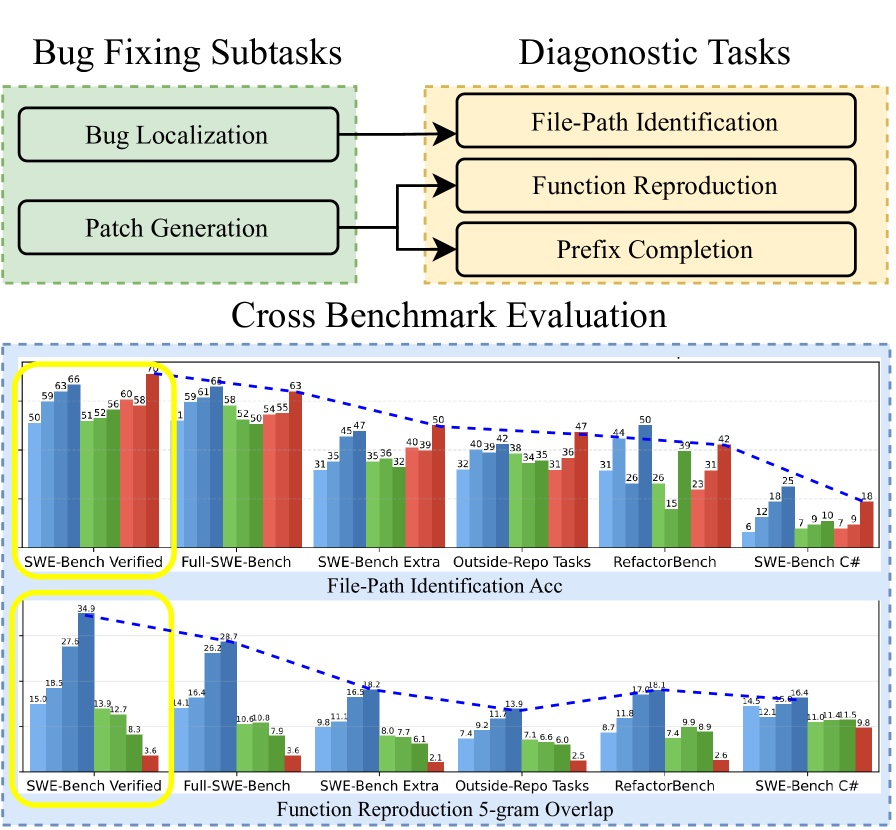

</div>
</div>

<!--
Microsoft Research가 NeurIPS 2025에서 발표. SWE-bench의 12개 레포는 GitHub에서 가장 인기있는 Python 프로젝트들로, 모든 주요 LLM의 훈련 데이터에 포함되었을 것이 거의 확실합니다.

실험 설계의 핵심: 모델 내부에 접근하지 않고, 행동 패턴만으로 암기를 탐지합니다.
-->

---

# 세 가지 진단 실험

<div class="grid grid-cols-3 gap-4" style="font-size: 0.8em">
<div>

<div class="highlight-box warning">

**실험 1**<br>파일 경로 맞추기

코드 없이 이슈 설명만으로<br>버그 파일 경로 예측

순수 추론으로는 **불가능** → 암기가 유일한 설명

</div>

</div>
<div>

<div class="highlight-box warning">

**실험 2**<br>함수 재현

이슈 설명 + 파일(함수 제거)로<br>정확한 함수 구현 재현

5-gram 중복 비율로 측정

</div>

</div>
<div>

<div class="highlight-box warning">

**실험 3**<br>접두사 완성

PR 수정 전 코드 접두사에서<br>원본 코드 완성

정확한 문자열 일치율 측정

</div>

</div>
</div>

<!--
세 실험 모두 핵심 아이디어: 코드를 "추론"해서 맞출 수 없는 상황을 설계합니다.
- 실험 1: 코드 구조를 모르면 파일 경로를 추론할 수 없습니다. 맞춘다면 암기입니다.
- 실험 2: 함수가 제거된 상태에서 정확히 재현한다면 암기입니다.
- 실험 3: 코드 접두사에서 정확한 원본 완성이 암기를 직접 증명합니다.
-->

---

# 핵심 실험: 파일 경로 맞추기
<br>
<div class="stat-grid">
  <div class="stat-card green">
    <div class="stat-number">76%</div>
    <div class="stat-label">SWE-bench Verified<br>파일 경로 정확도</div>
  </div>
  <div class="stat-card red">
    <div class="stat-number">53%</div>
    <div class="stat-label">외부 레포지토리<br>파일 경로 정확도</div>
  </div>
  <div class="stat-card yellow">
    <div class="stat-number">23%p</div>
    <div class="stat-label">성능 격차</div>
  </div>
</div>

- 모델에게 **이슈 설명만** 제공 (코드 접근 불가)
- 버그가 있는 파일의 경로를 예측하도록 요청
- 코드를 보지 않고도 경로를 맞출 수 있다면?

<!--
코드를 보지도 않고 76% 정확도로 파일 경로를 맞춘다는 것은, 모델이 이미 이 벤치마크의 정답을 "알고 있다"는 강력한 증거입니다.

비교: Verified(76%) > Full(71%) > Extra(68%) > 외부 레포(53%)
이 그래디언트 자체가 오염 정도와 정확히 대응합니다.
-->

---

# 파일 경로 정확도 비교

<div class="grid grid-cols-2 gap-6">
<div>

### 데이터셋별 파일 경로 정확도

오염도가 높을수록 → 파일 경로 정확도 높음

| 데이터셋 | 정확도 |
|---------|-------|
| SWE-bench Verified | **76%** |
| SWE-bench Full | 71% |
| SWE-bench Extra | 68% |
| 외부 레포지토리 | 53% |

</div>
<div>

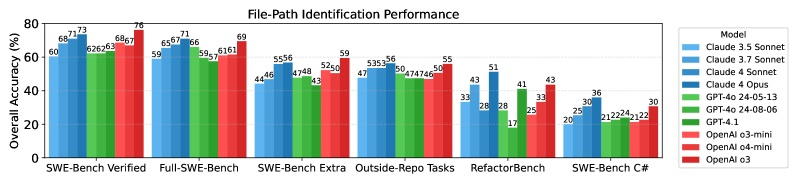

<p class="source" style="text-align: center">모델별·데이터셋별 파일 경로 정확도</p>

</div>
</div>

<!--
이 그래디언트가 핵심 증거입니다: 만약 모델이 순수 추론으로 파일 경로를 맞춘다면, 데이터셋마다 정확도가 달라질 이유가 없습니다. 오염 정도에 따라 정확도가 체계적으로 달라진다는 것은 암기를 직접 증명합니다.
-->

---

# 오염도 그래디언트

<p class="chart-note">파일 경로 식별 정확도 (%) — 데이터 소스별</p>

<ChartContamination />

<!--
오염도가 가장 높은 Verified에서 가장 높은 정확도, 외부 레포에서 가장 낮은 정확도. 깨끗한 그래디언트가 오염을 증명합니다.
-->

---

# 암기의 정량적 증거

<div class="grid grid-cols-2 gap-6">
<div>

### 함수 재현 실험 (5-gram 중복률)

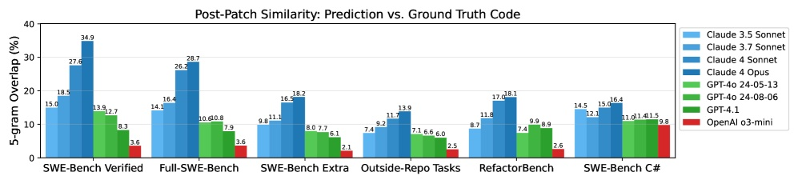

| 데이터셋 | 최고 중복률 |
|----------|------------|
| SWE-bench Verified | **34.9%** |
| SWE-bench Full | 28.7% |
| 외부 벤치마크 | 18.1% |

</div>
<div>

### 접두사 완성 실험 (정확 일치율)

| 모델 | 정확 일치율 |
|------|-----------|
| Claude 4 Opus | **31.6%** |
| Claude 4 Sonnet | 21.4% |
| GPT-4o | 17.4~18.4% |
| Claude 3.7 Sonnet | 12.3% |

<div class="highlight-box danger" style="margin-top: 0.5em; font-size: 0.85em">

Claude 4 Opus: 코드 접두사에서<br>31.6%가 원본과 **정확히 일치**<br>→ 추론이 아니라 기억

</div>

</div>
</div>

<!--
함수 재현: SWE-bench Verified에서 외부 벤치마크보다 2배 높은 5-gram 중복률. 이는 모델이 패치 내용을 텍스트 단위로 기억하고 있다는 증거입니다.

접두사 완성: Claude 4 Opus는 코드 접두사에서 31.6%가 정확히 원본과 일치합니다. 이것은 "추론"이 아니라 "기억"입니다.

이 두 데이터를 합치면: SWE-bench Verified에서의 높은 점수가 상당 부분 암기에 기반한다는 결론이 나옵니다.
-->

---

# 두 가지 암기 패턴

<div class="grid grid-cols-2 gap-8">
<div>

<div class="highlight-box warning">

### 인스턴스별 암기
특정 이슈-솔루션 쌍을<br>학습 데이터에서 기억

<hr>

<p class="small">증거: Verified > Full > Extra<br>단계적 성능 하락</p>

</div>

</div>
<div>

<div class="highlight-box warning">

### 레포 편향 암기
특정 레포의 구조와<br>패턴을 과적합

<hr>

<p class="small">증거: SWE-bench 레포 vs 외부 레포<br>최대 <strong>47%p</strong> 격차</p>

</div>

</div>
</div>

---

# 리더보드 경쟁의 함의

- 높은 SWE-bench 점수 ≠ 높은 범용 코딩 능력
- 모델 학습 시 벤치마크 레포 데이터가 포함될 수밖에 없음
- 신규 모델일수록 더 많은 데이터에 노출 → **점수 인플레이션**
- 공정한 비교를 위한 새로운 접근 필요

<div class="highlight-box danger">

벤치마크의 가치는 **오염으로부터의 자유도**에 비례한다

</div>

<!--
한계 고백: 이 논문도 완벽하지 않습니다.
- RefactorBench는 더 큰 레포, 짧은 이슈 설명 → 난이도 교란 변수 존재
- 모델 내부 훈련 데이터 접근 불가 → 모든 결론은 행동 패턴에서의 추론
- "암기와 유사한 행동"이 단지 "뛰어난 일반화"일 가능성을 완전히 배제할 수 없음

하지만 증거의 일관성 (복수의 실험, 복수의 모델, 깨끗한 그래디언트)은 오염 가설을 강하게 지지합니다.
-->

---
layout: section
---

# SWE-rebench: 지속적 갱신

<p class="section-subtitle">주기적 갱신 전략 (2025)</p>

---

# SWE-rebench
<br>
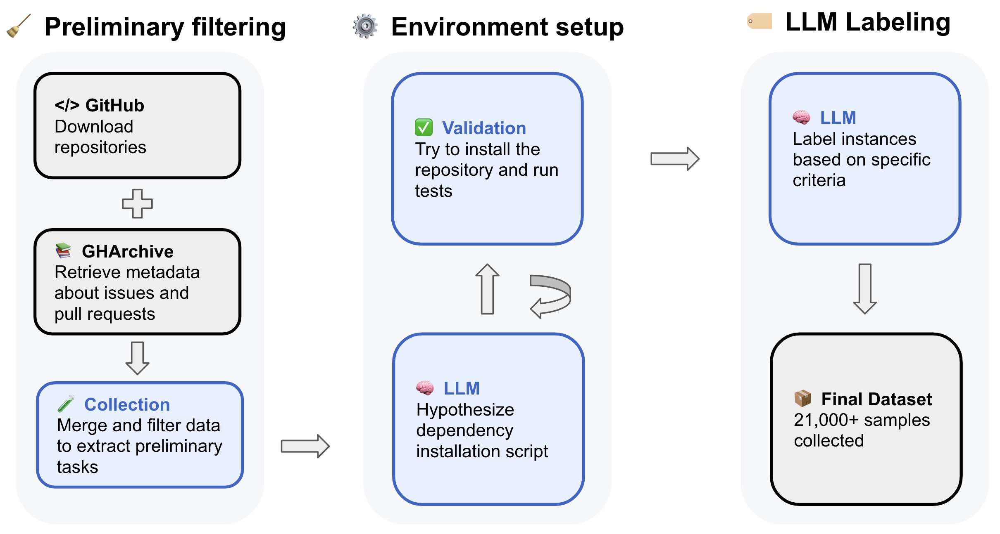

- ~450,000개 PR → ~153,400개 후보 → **21,336개** 최종
- LLM(Qwen2.5-72B)이 Docker 레시피 자동 생성
- 품질 자동 평가: 이슈 명확도 79%, 복잡도 81% 정확도

<p class="source">Badertdinov et al., NeurIPS 2025 Datasets & Benchmarks</p>

<!--
SWE-rebench의 4단계 파이프라인:
1. Preliminary Task Collection: 30,000+ 레포에서 ~450,000 PR 수집, 필터링으로 153,400개 후보
2. Automated Installation Config: LLM이 최대 3개 Docker 설치 레시피 생성, 반복 개선
3. Execution-Based Verification: fail-to-pass 검증, 분산 컨테이너로 실행
4. Automated Quality Assessment: 파인튜닝된 LLM이 품질 점수 예측

핵심 발견: GPT-4.1이 2025년 3~4월 신규 태스크에서 기존 태스크보다 성능 하락 → SWE-bench Verified 점수 인플레이션 증거

한계: 31% 설치 성공률이 낮음. Python-only. 표준화된 ReAct 스캐폴드 사용으로 모델별 최적화 없음.
-->

---

# SWE-rebench: 핵심 발견

<div class="grid grid-cols-2 gap-8">
<div>

### 점수 인플레이션 실증

<div class="highlight-box danger">

GPT-4.1이 **신규 태스크**(2025년 3~4월)에서<br>기존 SWE-bench Verified보다 성능 하락

→ 높은 Verified 점수의 상당 부분이<br>**오염/과적합**에 기인할 가능성

</div>

<div class="highlight-box warning" style="margin-top: 0.8em">

### 자동화-품질 트레이드오프
- LLM이 자동 생성한 Docker 레시피<br>→ 설치 성공률 **31%** (매우 낮음)
- 품질 자동 평가: 이슈 명확도 79%,<br>복잡도 81% (인간 대비)

</div>

</div>
<div>

### 시사점

<div class="stat-grid" style="grid-template-columns: repeat(2, 1fr); gap: 0.5em">
  <div class="stat-card green">
    <div class="stat-number" style="font-size: 1.4em">3,468</div>
    <div class="stat-label">다양한 레포<br>(vs Verified 12개)</div>
  </div>
  <div class="stat-card red">
    <div class="stat-number" style="font-size: 1.4em">31%</div>
    <div class="stat-label">설치 성공률<br>자동화의 한계</div>
  </div>
</div>

<div class="highlight-box info" style="margin-top: 0.5em; font-size: 0.85em">

대규모 자동화 ↑ → 개별 샘플 품질 ↓<br>
이 트레이드오프가 주기적 갱신 전략의 핵심 과제

</div>

</div>
</div>

<!--
SWE-rebench의 가장 중요한 기여는 "점수 인플레이션 실증"입니다. 같은 모델(GPT-4.1)로 오래된 태스크(Verified)와 새 태스크(2025년 이후)를 비교했을 때 성능 차이가 나타난다면, 이는 오래된 태스크에 과적합이 일어났다는 증거입니다.
-->

---
layout: section
---

# SWE-bench Pro: 접근 제한

<p class="section-subtitle">비공개 코드 기반 평가 (2025)</p>

---

# SWE-bench Pro

<div class="grid grid-cols-2 gap-8">
<div>

### 3단계 데이터셋 구조

<div class="highlight-box info">

**Public (731개)**<br>GPL Copyleft 라이선스 레포<br>→ 법적 위험으로 학습 억제

</div>
<div class="highlight-box warning" style="margin-top: 0.5em">

**Held-out (858개)**<br>비공개 유지 → 미래 과적합 탐지용

</div>
<div class="highlight-box danger" style="margin-top: 0.5em">

**Commercial (276개)**<br>18개 스타트업 비공개 코드<br>→ 학습 데이터에 포함 **불가능**

</div>

</div>
<div>
<br><br>
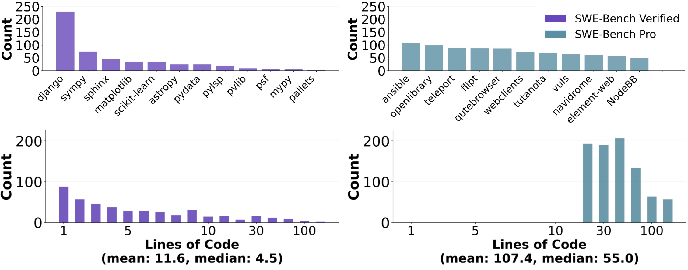

<div style="font-size: 0.75em; margin-top: 0.3em">

- 평균 패치: **107.4줄 / 4.1개 파일**  ·  최소 10줄 의무화

</div>

</div>
</div>

<p class="source">Deng et al., Scale AI, arXiv 2025</p>

<!--
SWE-bench Pro의 핵심 혁신: GPL 라이선스를 오염 방어막으로 사용하는 아이디어. 폐쇄형 모델이 GPL 코드를 훈련에 포함시키면 법적 위험이 있어서 자연스럽게 억제됩니다.

Commercial Set은 더욱 강력: 스타트업과 파트너십을 맺어 미공개 코드를 확보. 이 코드는 훈련 데이터에 절대 포함될 수 없습니다.

인간 보강의 목적: false negative 감소. 원본 이슈의 8.4~25.9%가 누락된 맥락으로 인해 올바른 해결책도 테스트를 통과 못하는 문제를 해결합니다.
-->

---

# SWE-bench Pro: 데이터 분포

<br>
<div class="grid grid-cols-2 gap-6">
<div>

### Public 데이터셋 특성
- 평균 패치: **107.4줄 / 4.1개 파일**
- 최소 10줄 의무화 (단순 수정 제외)
- SWE-bench Verified(32.8줄/1.7파일) 대비 **3~4배 복잡**

<br>

### 태스크 카테고리
- Bug Fix: 가장 높은 비율
- New Feature: 기능 추가
- Feature Optimization: 개선

</div>
<div>

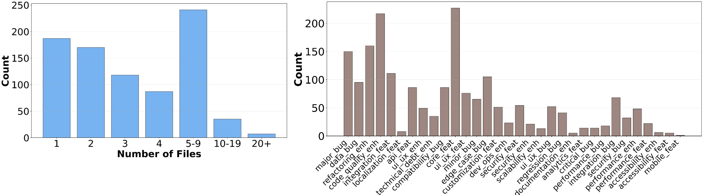

<p class="source" style="text-align: center">파일 수 분포 + 태스크 카테고리 분포</p>

</div>
</div>

<!--
SWE-bench Pro의 복잡도 강조: 평균 패치 107.4줄, 4.1개 파일은 SWE-bench Verified(32.8줄, 1.7파일)의 약 3배입니다. 이는 더 현실적인 엔지니어링 작업을 반영합니다. 단순 버그 픽스가 아닌 실질적인 소프트웨어 개발 능력을 테스트합니다.
-->

---

# Public vs Private: 현실 격차

<p class="chart-note">SWE-bench Pro 해결률 (%) — Public vs Private</p>

<ChartSWEPro />

<!--
Private 코드에서의 성능 하락이 모델의 "진짜 실력"에 더 가까울 수 있습니다. GPT-5의 경우 23.1% → 14.9%로 8.2%p 하락.
-->

---

# SWE-bench Pro: 언어별 성능

<div class="grid grid-cols-2 gap-6">
<div>

### 주요 발견
- 파일 수 증가 → 모든 모델 성능 급락
- 코드 줄수 증가 → 동일 경향
- 언어별 성능 편차 존재
  - 상대적 강세: Python, Java
  - 상대적 약세: C/C++, Rust

<div class="highlight-box warning" style="margin-top: 0.8em; font-size: 0.85em">

**교차 파일 추론** 능력 부족이<br>공통 병목으로 확인됨<br>
(Multi-SWE-bench 발견과 일치)

</div>

</div>
<div>

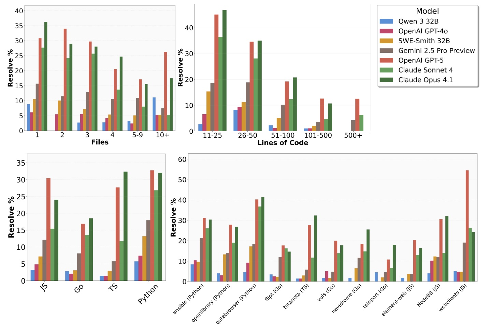

<p class="source" style="text-align: center">파일 수별 / 줄 수별 / 언어별 / 레포별 성능</p>

</div>
</div>

<!--
SWE-bench Pro의 언어별 분석이 Multi-SWE-bench의 발견을 보강합니다. 두 벤치마크 모두 교차 파일 추론 능력 부족을 핵심 병목으로 지목합니다.

파일 수 증가에 따른 성능 급락은 현재 에이전트 아키텍처의 근본적 한계를 보여줍니다.
-->

---

# SWE-bench Pro: 실패 분석

<p class="source">LLM-as-Judge로 실패 원인 분류</p>

| 실패 원인 | Claude Opus 4.1 | Claude Sonnet 4 | Qwen3 32B |
|----------|----------------|----------------|----------|
| 잘못된 솔루션 | 35.9% | — | — |
| 컨텍스트 오버플로우 | — | 35.6% | — |
| 문법 오류 | 24.2% | — | — |
| 도구 사용 실패 | — | — | **42.0%** |
| 무한 파일 읽기 | 17.0% | — | — |

<div class="highlight-box warning">

**컨텍스트 오버플로우**가 공통 병목 — 긴 코드베이스를 처리하는 능력이 핵심 과제

</div>

<!--
실패 분석의 시사점:
1. 모델마다 다른 실패 패턴: Opus 4.1은 솔루션 오류가 많고, 오픈소스 모델은 도구 사용 실패가 많음
2. 컨텍스트 오버플로우: 긴 코드베이스를 다 읽으려다 컨텍스트 창이 가득 찬 경우
3. 무한 파일 읽기: 어디를 수정해야 할지 몰라서 계속 파일을 탐색하다 종료. Fault Localization 능력 부족의 또 다른 증거

한계: 비공개 Commercial Set 접근 제한으로 커뮤니티 재현 어려움 / Java, C++, Rust 언어 비중 낮음 / 에이전트 50턴, $2 비용 상한선
-->

---

# 대응 전략 트레이드오프

| | 주기적 갱신 | 접근 제한 |
|--|------------|----------|
| 대표 | SWE-rebench | SWE-bench Pro |
| 장점 | 대규모, 자동화, 최신 이슈 | 오염 근본 차단 |
| 단점 | <span class="red">개별 샘플 품질 저하</span> | <span class="red">라이선스 일관성 문제</span> |
| 한계 | 갱신 주기 내 오염 가능 (31% 설치 성공률) | 새 기술 패러다임 반영 어려움 |

<p class="emphasis">두 전략 모두 완벽하지 않다 — 상호보완적 접근 필요</p>

---
layout: section
---

# 남은 과제와 전망

<p class="section-subtitle">벤치마크 너머의 소프트웨어 엔지니어링</p>

---

# 벤치마크 진화의 교훈

<div class="timeline-vertical">
  <div class="timeline-item">
    <div class="timeline-year">2021</div>
    <div class="timeline-content">
      <strong>HumanEval</strong> — 함수 단위, Python, pass@k 도입<br>
      <span class="small">→ 한계: 포화 (4년 후 96%), 비현실적, 오염 취약</span>
    </div>
  </div>
  <div class="timeline-item">
    <div class="timeline-year">2023</div>
    <div class="timeline-content">
      <strong>SWE-bench</strong> — 실제 GitHub 이슈, Docker 환경<br>
      <span class="small">→ 한계: Python 전용, 품질 문제(68% 필터링 필요)</span>
    </div>
  </div>
  <div class="timeline-item">
    <div class="timeline-year">2024</div>
    <div class="timeline-content">
      <strong>Verified / Multi-SWE-bench</strong> — 품질 보장, 다언어 확장<br>
      <span class="small">→ 한계: 오염 문제 부각, Python 편향 여전히 20%p+</span>
    </div>
  </div>
  <div class="timeline-item">
    <div class="timeline-year">2025</div>
    <div class="timeline-content">
      <strong>rebench / Pro</strong> — 오염 대응, 장기 과제<br>
      <span class="small">→ 한계: 자동화-품질 균형 (31% 설치 성공률), Private 코드 접근 제한</span>
    </div>
  </div>
</div>

---

# 맺음말

<div class="key-messages">
  <div class="key-message">
    <span class="msg-number">1</span>
    <p>현재 벤치마크 숫자만으로 <strong>SW 엔지니어링 능력</strong>을 판단하기는 어렵다<br>
    <span class="small">— SWEBOK 18개 영역 중 코딩 일부만 평가, 오염 가능성 상존</span></p>
  </div>
  <div class="key-message">
    <span class="msg-number">2</span>
    <p><strong>다양한 언어와 환경</strong>을 포괄하면서도 <strong>오염에 강건한</strong> 벤치마크가 필요하다<br>
    <span class="small">— Python 편향 20%p+(Multi-SWE-bench), SWE-bench Pro의 Public vs Private 격차가 그 필요성을 실증</span></p>
  </div>
  <div class="key-message">
    <span class="msg-number">3</span>
    <p><strong>자동화와 품질</strong> 사이의 적정 지점을 찾는 것이 핵심 설계 과제다<br>
    <span class="small">— 31% 설치 성공률(rebench) vs 비공개 코드 접근 제한(Pro)</span></p>
  </div>
  <div class="key-message">
    <span class="msg-number">4</span>
    <p><strong>에이전틱 코딩</strong> 시대에 맞는 새로운 평가 방식 설계가 시작되고 있다<br>
    <span class="small">— 멀티파일 수정, 장기 태스크, 대화형 디버깅을 포함하는 방향으로</span></p>
  </div>
</div>

<!--
맺음말: 벤치마크를 만드는 것과 신뢰할 수 있는 벤치마크를 만드는 것은 다릅니다. 우리가 "측정하고 있다고 생각하는 것"과 "실제로 측정되는 것"이 다를 수 있습니다.
-->

---

# 디스커션: 앞으로의 방향?

<div class="grid grid-cols-2 gap-8">
<div>

### 열린 질문들

- 어떤 벤치마크가 **SE 역량**을 가장 잘 반영할까?
- **오염을 완전히 막는 것**은 가능한가?
- **에이전틱 코딩** 시대의 평가는 어떻게 달라져야 하나?
- 벤치마크 점수를 **어떻게 신뢰**할 수 있나?

</div>
<div>

### 여러분의 생각은?

<div class="highlight-box info" style="margin-top: 1em">

지금 사용하시는 코딩 도구를 어떻게 평가하시나요?<br>
벤치마크 점수가 그 판단에 얼마나 영향을 미치나요?

</div>

</div>
</div>

---
layout: center
---

# 감사합니다

---

# 참고문헌

<div class="references">
<ol>
<li>Chen et al., "Evaluating Large Language Models Trained on Code" (HumanEval), arXiv:2107.03374, 2021</li>
<li>Kulal et al., "SPoC: Search-based Pseudocode to Code," NeurIPS 2019</li>
<li>Jimenez et al., "SWE-bench: Can Language Models Resolve Real-World GitHub Issues?", ICLR 2024, arXiv:2310.06770</li>
<li>OpenAI Preparedness Team, "Introducing SWE-bench Verified", 2024</li>
<li>Zan et al., "Multi-SWE-bench: A Multilingual Benchmark for Issue Resolving," NeurIPS 2025, arXiv:2504.02605</li>
<li>Khandpur et al., "SWE-bench Multilingual", 2025</li>
<li>Liang et al., "The SWE-Bench Illusion: When State-of-the-Art LLMs Remember Instead of Reason," NeurIPS 2025, arXiv:2506.12286</li>
<li>Badertdinov et al., "SWE-rebench: An Automated Pipeline for Task Collection and Decontaminated Evaluation," NeurIPS 2025, arXiv:2505.20411</li>
<li>Zhang et al., "SWE-bench Goes Live!," NeurIPS 2025, arXiv:2505.23419</li>
<li>Deng et al., "SWE-Bench Pro: Can AI Agents Solve Long-Horizon SE Tasks?", arXiv:2509.16941, 2025</li>
<li>Bourque & Fairley (eds.), "SWEBOK V4", IEEE, 2024</li>
<li>Hu et al., "Assessing and Advancing Benchmarks for Evaluating LLMs in SE Tasks," arXiv:2505.08903, 2025</li>
<li>Mundler et al., "SWT-Bench: Assessing Capabilities at Unit Test Generation," NeurIPS 2024</li>
<li>Wang et al., "SDLC Perspective: A Survey of Benchmarks for Code LLMs and Agents," arXiv:2505.05283, 2025</li>
<li>Xia, Deng, Zhang, "EvoEval: Evolving Coding Benchmarks via LLM," COLM 2024, arXiv:2403.19114</li>
</ol>
</div>
