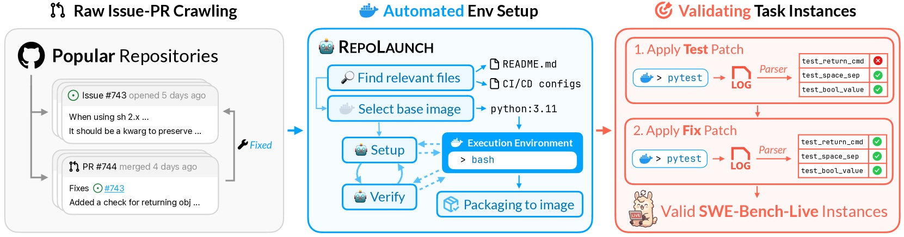
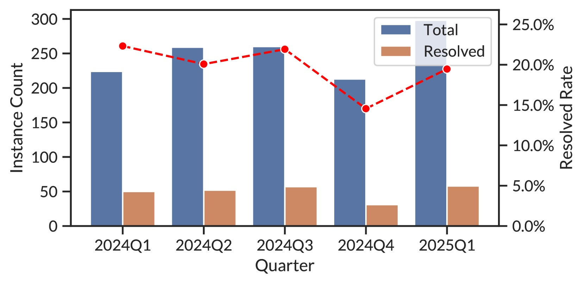

# LLM 코딩 벤치마크
## 진화의 궤적과 남은 과제

<p class="title-meta">Curt Park</p>

<!--
1시간 발표. LLM 코딩 벤치마크가 어떻게 진화해왔고, 어떤 한계가 남아있는지 논문 데이터를 기반으로 살펴봅니다.
-->

---

# Agenda

<ol class="agenda-list">
  <li>SE 벤치마크 조감도</li>
  <li>출발점: HumanEval</li>
  <li>현실 세계로: SWE-bench</li>
  <li>Python을 넘어서: 다국어 확장</li>
  <li>불편한 진실: 오염 문제</li>
  <li>오염 대응 전략</li>
  <li>남은 과제와 전망</li>
</ol>

<!--
총 7개 섹션으로 구성. 벤치마크의 계보를 시간순으로 따라가며 각 단계의 동기와 한계를 분석합니다.
-->

---

# 왜 코딩 벤치마크인가?

- LLM의 가장 활발한 응용 분야 = **코딩**
- "측정할 수 없으면 개선할 수 없다"
- 벤치마크 점수가 모델 선택과 투자를 결정
- 그러나... 벤치마크 점수 = 실제 능력?

<!--
벤치마크가 단순한 학술 도구를 넘어 산업에 미치는 영향이 큽니다. 하지만 점수의 의미를 정확히 이해하려면 벤치마크의 설계와 한계를 알아야 합니다.
-->

---

# SE 벤치마크 전체 조감도

<p class="chart-note">소프트웨어 엔지니어링 벤치마크 291개 분석 (2025)</p>

<ChartSEDistribution />

<p class="source">Source: Hou et al., 2025</p>

<!--
SE 전체 291개 벤치마크 중 코딩이 43%로 가장 많습니다. 요구사항 공학, 설계, 프로젝트 관리 등은 10% 미만으로, 정량적 자동 평가가 어려운 영역입니다.
-->

---
layout: section
---

# 출발점: HumanEval

<p class="section-subtitle">체계적 코딩 벤치마크의 시작 (2021)</p>

---

# 배경: BLEU 점수의 한계

<div class="grid grid-cols-2 gap-8">
<div>

### 기존 평가의 문제
- 코드 평가에 **BLEU 점수** 사용
- 텍스트 유사도로 코드 정확도 측정
- 실제로 실행되는지는 무관

</div>
<div>

### 왜 BLEU로는 부족한가?

```python
# 정답
def add(a, b): return a + b

# BLEU 높지만 틀린 코드
def add(a, b): return a - b

# BLEU 낮지만 맞는 코드
def sum_two(x, y): return x + y
```

</div>
</div>

<p class="emphasis">→ 기능적 정확성(functional correctness)을 직접 측정해야 한다</p>

<!--
HumanEval 이전에는 BLEU 점수로 코드 생성 모델을 평가했습니다. BLEU는 생성된 텍스트가 참조 텍스트와 얼마나 비슷한지를 측정하는데, 코드에서는 의미적으로 동일한 코드가 텍스트적으로 완전히 달리 쓰일 수 있습니다. 반대로 텍스트는 비슷하지만 버그가 있는 코드도 높은 점수를 받을 수 있습니다. OpenAI Codex 팀이 이 문제를 해결하려고 HumanEval을 만들었습니다.
-->

---

# HumanEval이란?

<div class="grid grid-cols-2 gap-8">
<div>

### 구조
- **164**개 Python 문제 (수작업 제작)
- 함수 시그니처 + 독스트링
- 문제당 평균 **7.7**개 유닛 테스트
- GitHub 코드 **제외** — 오염 방지

</div>
<div>

### 평가 메트릭: pass@k
- n개 샘플 생성 → c개 정답
- 불편 추정량 공식 사용:

$$\text{pass@k} = 1 - \frac{\binom{n-c}{k}}{\binom{n}{k}}$$

- pass@1: 실용적 지표
- pass@100: 잠재력 지표

</div>
</div>

<!--
HumanEval의 핵심 설계 원칙:
1. 수작업 제작: GitHub 코드를 그대로 가져온 게 아니라 직접 작성. 훈련 데이터 오염을 방지하기 위함입니다.
2. pass@k 메트릭: 단순히 k개 중 하나라도 맞으면 성공이라는 naive한 방식은 분산이 크기 때문에, 편향되지 않은 추정량 공식을 사용합니다. n개 샘플을 생성해서 c개가 맞았을 때, k개 선택했을 때 최소 1개가 맞을 확률을 정확하게 계산합니다.
3. 평균 7.7개 테스트: 하나의 문제당 다양한 엣지 케이스를 커버해서 우연한 통과를 방지합니다.
-->

---

# HumanEval 성능 추이

<p class="chart-note">pass@1 (%) — 4년간의 진화</p>

<ChartHumanEval />

<!--
초기 결과 비교:
- GPT-3: 0% (pass@1) — 일반 언어모델은 코드 생성 불가
- Codex (12B): 28.8% (pass@1), 72.3% (pass@100)
- 100개 샘플링 시 72%까지 올라감 → 반복 샘플링 전략의 유효성

2021년 Codex 28.8%에서 시작해 불과 4년 만에 96.3%까지 도달. 이 속도는 놀랍지만, 동시에 벤치마크가 사실상 포화 상태에 이르렀음을 의미합니다.
-->

---

# 벤치마크 포화의 증거

<div class="highlight-box warning">

### 변형 태스크에서의 성능 하락
Top 모델들이 HumanEval 원본에서는 90%+ 달성하지만,
변형된 태스크에서는 **<span class="red">19.6 ~ 47.7%p</span>** 하락

</div>

- 구성적 일반화(compositional generalization) 부족
- 문제를 "풀었다" vs 문제를 "외웠다"의 차이
- 추정 오염률 **8~18%** — 훈련 데이터와 근접 중복 존재

<!--
포화의 두 가지 원인:
1. 진짜 능력 향상: 모델이 실제로 더 잘하게 됨
2. 암기/오염: HumanEval 문제들이 인터넷에 공개되어 훈련 데이터에 포함됨

변형 태스크(함수 이름 변경, 입출력 형식 변경 등)에서 성능이 급락한다는 것은 모델이 유사한 패턴을 기억하는 경향이 있다는 증거입니다. 추정 오염률은 8~18%로, HumanEval 문제의 상당수가 훈련 데이터에 포함되어 있을 가능성이 있습니다.
-->

---

# HumanEval의 한계

| 한계 | 설명 |
|------|------|
| 범위 | 자기완결적 함수 단위만 평가 |
| 언어 | Python 단일 언어 |
| 복잡도 | 코드베이스 전체 이해 불필요 |
| 현실성 | 알고리즘 퍼즐 수준 — 실제 개발과 괴리 |
| 오염 | 학습 데이터 오염 가능성 8~18% 추정 |
| 포화 | 현대 모델 85~90%+ → 차별화 불가 |

<p class="emphasis">→ 더 현실적인 벤치마크가 필요하다</p>

<!--
HumanEval의 가장 큰 한계는 "실제 소프트웨어 개발"을 반영하지 않는다는 점입니다. 실제 개발자는:
- 수백만 줄의 기존 코드를 이해하고 수정합니다
- GitHub 이슈 설명을 읽고 버그를 재현합니다
- 여러 파일에 걸쳐 변경 사항을 만들어야 합니다
- 기존 테스트를 통과시켜야 합니다

164개 문제라는 작은 크기도 문제입니다. 통계적 유의성이 낮고, 다양한 능력을 측정하기에 부족합니다.
-->

---

# HumanEval → SWE-bench

<p class="emphasis">패러다임 전환의 필요성</p>

| | HumanEval | SWE-bench |
|--|-----------|-----------|
| 단위 | 함수 | 코드베이스 전체 |
| 맥락 | 독스트링 | 실제 GitHub 이슈 |
| 규모 | 164 문제 | 2,294 이슈 |
| 현실성 | 알고리즘 퍼즐 | 실제 버그/기능 |
| 난이도 | Top 모델 96%+ | Top 모델 ~20% |

---
layout: section
---

# 현실 세계로: SWE-bench

<p class="section-subtitle">실제 GitHub 이슈 기반 평가 (2023)</p>

---

# SWE-bench 탄생 배경

<div class="grid grid-cols-2 gap-8">
<div>

### 기존 벤치마크의 공통 한계
- 고립된 함수 작성만 평가
- 멀티파일 의존성 없음
- 코드베이스 관습 이해 불필요
- 자동화된 테스트 없거나 부족

</div>
<div>

### 핵심 인사이트
실제 소프트웨어 엔지니어링은:
- 대규모 코드베이스 **이해**
- 암묵적 관습 **추론**
- 컴포넌트 간 의존성 **파악**
- 기존 테스트 **통과**

</div>
</div>

<div class="highlight-box info">

**GitHub PR = 자연발생적 벤치마크**: 이슈 → 코드 수정 → 테스트 통과의 흐름이 이미 존재한다

</div>

<!--
SWE-bench의 핵심 아이디어는 "이미 존재하는 데이터를 활용하자"는 것입니다. GitHub의 실제 PR들은 (1) 문제 설명(이슈), (2) 해결책(코드 수정), (3) 검증(테스트)이 자연스럽게 붙어있습니다. 이것을 벤치마크로 변환하면 됩니다.

Princeton NLP 그룹이 2023년에 발표했으며 ICLR 2024 Oral 채택됩니다.
-->

---

# SWE-bench 구축 파이프라인

<div class="grid grid-cols-2 gap-8">
<div>

### 데이터 수집
1. GitHub에서 PR ~90,000개 수집
2. **3가지 필터링 조건:**
   - Merged PR
   - GitHub 이슈와 연결
   - 테스트 파일 수정 포함
3. 최종 **2,294**개 인스턴스

</div>
<div>

### 실행 환경
- PR 병합 직전 커밋 기준으로<br>**Docker 환경** 구성
- 패치 적용 전: 테스트 **실패**
- 패치 적용 후: 테스트 **통과**
- 이슈 설명 평균 **195단어**
- 참조 패치: 중앙값 1~2개 파일, 4~10줄

</div>
</div>

<p class="source">12개 레포: Django(850), sympy(386), scikit-learn(229), sphinx(187), matplotlib(184) 등</p>

<!--
구축 파이프라인의 핵심:
1. 필터링: 90,000개 PR 중 2,294개만 통과. 가장 중요한 조건은 "테스트 파일 수정 포함"입니다. 이 조건이 있어야 실행 기반 평가가 가능합니다.
2. Docker 환경: 재현 가능한 평가를 위해 각 인스턴스마다 독립적인 실행 환경을 구성합니다.
3. Fail-to-Pass 검증: 패치 전에는 실패하고, 패치 후에는 통과하는 테스트를 기준으로 합니다. 이것이 "실제로 해결했다"는 증거입니다.

12개 레포 중 Django가 850개로 가장 많고, Flask가 11개로 가장 적습니다. 불균형이 있지만 모두 실제 프로덕션 코드라는 점이 중요합니다.
-->

---

# SWE-bench 초기 결과

<div class="stat-grid">
  <div class="stat-card red">
    <div class="stat-number">1.96%</div>
    <div class="stat-label">Claude 2<br>(최초 최고 성능)</div>
  </div>
  <div class="stat-card yellow">
    <div class="stat-number">12.47%</div>
    <div class="stat-label">SWE-agent + GPT-4<br>(에이전트 접근법)</div>
  </div>
  <div class="stat-card">
    <div class="stat-number">2,294</div>
    <div class="stat-label">전체 태스크 수</div>
  </div>
</div>

<p class="emphasis">HumanEval 96% 달성 모델이 SWE-bench에서는 2% 미만</p>

<!--
초기 결과가 충격적이었던 이유:
- HumanEval에서 84% 이상을 달성하는 Claude 2가 SWE-bench에서는 1.96%
- 이는 두 벤치마크가 측정하는 것이 근본적으로 다르다는 증거입니다

SWE-agent는 단순 LM API 호출이 아니라 "에이전트"로서 코드베이스를 탐색하고 파일을 수정하는 도구를 사용합니다. 이 방식으로 12.47%까지 올렸지만, 여전히 인간 개발자 수준과는 거리가 멉니다.

기여: 1) 최초의 실제 GitHub 이슈 기반 벤치마크, 2) 2,294개 태스크 + Docker 환경, 3) SWE-Llama 파인튜닝 베이스라인, 4) 훈련 데이터/모델 가중치 오픈소스 공개
-->

---

# SWE-bench의 품질 문제

- 2,294개 중 상당수가 **모호**하거나 **불명확**
- 테스트 사양이 불충분한 경우 존재
- 올바른 솔루션도 테스트 실패 가능
- 벤치마크 자체의 신뢰성 의문 제기

<div class="highlight-box warning">

실제로 발견된 문제들:
- 이슈 설명이 불완전해 PR 토론 내용까지 읽어야 이해 가능
- 테스트가 특정 에러 메시지 문자열을 검사하는 등 과도하게 구체적
- Deprecated API 사용 방식 등 암묵적 맥락 누락

</div>

<p class="emphasis">→ 품질 검증된 부분집합이 필요하다</p>

---

# SWE-bench Verified

<div class="grid grid-cols-2 gap-8">
<div>

### 전문가 검증 프로세스
- Upwork 모집 **93**명 전문 Python 개발자
- **1,699**개 샘플 어노테이션
- 전체 500개에 **3중 교차 검증**
- 0~3점 심각도 체계로 평가

</div>
<div>

### 필터링 결과

| 문제 유형 | 비율 |
|----------|------|
| 불명확한 문제 설명 | **38.3%** |
| 부당한 테스트 케이스 | **61.1%** |
| 전체 제거 비율 | **68.3%** |
| **최종 선정** | **500개** |

</div>
</div>

<!--
Verified 제작 과정에서 밝혀진 충격적 사실:
- 원본 SWE-bench의 68.3%가 어떤 형태로든 품질 문제가 있음
- 특히 테스트 케이스가 61.1%에서 부당하게 정답을 거부할 수 있음
- 이는 SWE-bench 점수가 실제 능력보다 낮게 측정되었을 수 있음을 의미

난이도 분류: Easy 196개 (숙련 개발자 기준 <15분), Hard 45개 (>1시간), 나머지는 중간 난이도
annotation scheme: 두 축(문제 설명 품질, 테스트 케이스 품질) 각각 0~3점, 어느 하나라도 ≥2이면 제거

기여: 1) 커뮤니티 표준 평가 세트, 2) 이슈 벤치마크 품질 실패 유형 분류법, 3) Docker 재현 환경, 4) HuggingFace 공개
한계: Python-only 12개 레포 유지, 500개로 세밀한 능력 비교 어려움, 오염 위험 여전히 존재
-->

---

# SWE-bench Verified 리더보드

<p class="chart-note">해결률 (%) — 2026년 2월 기준</p>

<ChartSWEVerified />

<!--
Verified에서는 상위 모델이 80%를 돌파. Full에서 20%였던 것과 극적인 대비. Verified 기준으로 모델 간 차이가 더 잘 드러납니다.

주목할 점: 2024년 8월 공개 당시 최고 성능이 33.2%(GPT-4o)였는데, 1년 반 만에 80%를 넘겼습니다. 이 속도가 실제 능력 향상인지, 아니면 오염/과적합인지가 논쟁의 핵심입니다.
-->

---

# Verified vs Full의 의미

| | SWE-bench Full | SWE-bench Verified |
|--|----------------|-------------------|
| 크기 | 2,294 | 500 |
| Top 성능 | ~20% | ~81% |
| 품질 보장 | 자동화 | 전문가 3중 검증 |
| 주요 용도 | 도전적 평가 | 모델 비교 |

<div class="highlight-box warning">

같은 "SWE-bench"라도 어떤 버전인지에 따라<br>점수의 의미가 완전히 다르다

</div>

---

# SWE-bench의 남은 한계

<div class="highlight-box warning">

### Python Only
12개 레포 모두 Python<br>
실제 소프트웨어 세계는 다양한 언어로 구성

</div>

<div class="highlight-box warning">

### 정적 스냅샷
한번 수집 후 업데이트 없음 → 오염 누적<br>
모든 주요 LLM의 훈련 데이터 컷오프 이전 이슈들

</div>

<p class="emphasis">→ 다국어 + 동적 갱신 벤치마크의 필요성</p>

---
layout: section
---

# Python을 넘어서

<p class="section-subtitle">다국어 벤치마크의 등장</p>

---

# Multi-SWE-bench

<p class="source">ByteDance Seed, NeurIPS 2025 Datasets & Benchmarks</p>

<div class="grid grid-cols-2 gap-8">
<div>

### 규모
- **7**개 언어
- **1,632**개 인스턴스
- **68**명 전문 어노테이터
- 5단계 검증 파이프라인
- 초기 RL 데이터셋 **4,723**개

</div>
<div>

### 모델별 해결률


</div>
</div>

<!--
Multi-SWE-bench의 구축 과정:
1. GitHub에서 ≥500스타 레포 선별
2. 이슈 연결 PR 수집
3. Docker 기반 실행 환경 구성 (테스트 3가지 설정으로 검증)
4. 68명 전문 어노테이터가 최소 80% 정확도 기준으로 이중 검증
5. 2,456개 후보에서 1,632개 최종 선정

기여: 가장 광범위한 다국어 SWE 벤치마크 + Multi-SWE-RL 오픈소스 커뮤니티

한계: 크로스 파일 수정과 긴 패치가 주요 실패 원인 / TypeScript 컨텍스트 오버플로우 문제 등 언어별 특수 문제 아직 미해결 / 현재 에이전트는 ~15분 이내 해결 가능한 이슈만 잘 처리함
-->

---

# SWE-bench Multilingual

<p class="source">SWE-bench 원저자팀, NeurIPS 2025 (SWE-smith 논문과 함께 공개)</p>

<div class="grid grid-cols-2 gap-8">
<div>

### 규모
- **9**개 언어
- **42**개 레포지토리
- **300**개 큐레이션 태스크
- 반자동 + 수동 검증 결합

</div>
<div>

### 지원 언어
- C, C++, Go, Java
- JavaScript, TypeScript
- PHP, Ruby, Rust

### 언어별 특징
- Rust: **최고** 해결률
- C/C++: **최저** 해결률

</div>
</div>

<!--
SWE-bench Multilingual은 SWE-smith 논문의 부산물로 공개되었습니다. SWE-smith는 Python SWE 에이전트 학습 데이터를 자동 생성하는 파이프라인인데, Multilingual 벤치마크를 companion으로 제공했습니다.

300개로 규모가 작습니다 (언어당 평균 33개). 이 때문에 세밀한 비교는 어렵고, 빠른 평가 목적에 적합합니다.

Claude 3.7 Sonnet + SWE-agent 기준: Verified(Python) 63% vs Multilingual 43%. 이 20%p 격차가 Python 편향의 증거입니다.
-->

---

# Python vs 다국어 성능 격차

<p class="chart-note">SWE-bench Verified (Python) vs Multilingual 해결률 (%)</p>

<ChartMultilingual />

<!--
Claude 3.7 Sonnet 기준으로 Python에서 63%, Multilingual에서 43%로 무려 20%p 격차. LLM이 Python에 치우쳐 학습되어 있음을 보여줍니다.

Multi-SWE-bench에서 더 극단적인 차이: Python 36~52% vs 다른 언어 1~21%.
-->

---

# 다국어 벤치마크의 발견

- **Python 편향**: Multi-SWE-bench에서 Python 36~52% vs 타 언어 1~21%
- **Fault Localization** 실패가 주요 원인 — 수정할 파일을 못 찾는 것
- 패치가 **600 토큰 초과** 시 성능 ~50% 감소
- 난이도가 올라갈수록 해결률 급격히 하락 (쉬운 이슈 ~60% vs 어려운 이슈 ~2%)

<div class="highlight-box info">

LLM의 코딩 능력은 **언어에 따라 크게 다르다**<br>
Python 기준 점수로 일반화하면 안 된다

</div>

---

# 다국어 벤치마크 비교

| | Multi-SWE-bench | SWE-bench Multilingual |
|--|-----------------|----------------------|
| 주체 | ByteDance Seed | SWE-bench 원저자 |
| 언어 수 | 7 | 9 |
| 인스턴스 | 1,632 | 300 |
| 검증 | 68명 전문가, 5단계 | 반자동 + 수동 |
| RL 데이터 | 4,723개 별도 제공 | 미제공 |
| 특징 | 대규모, 훈련용 포함 | 빠른 평가 목적 |

---
layout: section
---

# 불편한 진실

<p class="section-subtitle">데이터 오염 문제</p>

---

# The SWE-Bench Illusion

<p class="source">Liang et al., Microsoft Research — NeurIPS 2025</p>

<div class="highlight-box danger">

### 핵심 질문
모델이 벤치마크를 정말 **"풀고"** 있는가,<br>
아니면 **"기억해내고"** 있는가?

</div>

<div class="grid grid-cols-2 gap-8">
<div>

**평가 모델**: OpenAI 6개 + Anthropic 4개<br>
(GPT-4o, o3, Claude 3.5~4.0 등 **10개** 모델)

**비교 대상**: SWE-bench Verified, Full, Extra, 외부 레포

</div>
<div>


</div>
</div>

<!--
Microsoft Research가 NeurIPS 2025에서 발표. SWE-bench의 12개 레포는 GitHub에서 가장 인기있는 Python 프로젝트들로, 모든 주요 LLM의 훈련 데이터에 포함되었을 것이 거의 확실합니다.

실험 설계의 핵심: 모델 내부에 접근하지 않고, 행동 패턴만으로 암기를 탐지합니다.
-->

---

# 세 가지 진단 실험

<div class="grid grid-cols-3 gap-4" style="font-size: 0.8em">
<div>

<div class="highlight-box warning">

**실험 1**<br>파일 경로 맞추기

코드 없이 이슈 설명만으로<br>버그 파일 경로 예측

순수 추론으로는 **불가능**<br>→ 암기가 유일한 설명

</div>

</div>
<div>

<div class="highlight-box warning">

**실험 2**<br>함수 재현

이슈 설명 + 파일(함수 제거)로<br>정확한 함수 구현 재현

5-gram 중복 비율로 측정

</div>

</div>
<div>

<div class="highlight-box warning">

**실험 3**<br>접두사 완성

PR 수정 전 코드 접두사에서<br>원본 코드 완성

정확한 문자열 일치율 측정

</div>

</div>
</div>

<!--
세 실험 모두 핵심 아이디어: 코드를 "추론"해서 맞출 수 없는 상황을 설계합니다.
- 실험 1: 코드 구조를 모르면 파일 경로를 추론할 수 없습니다. 맞춘다면 암기입니다.
- 실험 2: 함수가 제거된 상태에서 정확히 재현한다면 암기입니다.
- 실험 3: 코드 접두사에서 정확한 원본 완성이 암기를 직접 증명합니다.
-->

---

# 핵심 실험: 파일 경로 맞추기

- 모델에게 **이슈 설명만** 제공 (코드 접근 불가)
- 버그가 있는 파일의 경로를 예측하도록 요청
- 코드를 보지 않고도 경로를 맞출 수 있다면?

<div class="stat-grid">
  <div class="stat-card green">
    <div class="stat-number">76%</div>
    <div class="stat-label">SWE-bench Verified<br>파일 경로 정확도</div>
  </div>
  <div class="stat-card red">
    <div class="stat-number">53%</div>
    <div class="stat-label">외부 레포지토리<br>파일 경로 정확도</div>
  </div>
  <div class="stat-card yellow">
    <div class="stat-number">23%p</div>
    <div class="stat-label">성능 격차</div>
  </div>
</div>

<!--
코드를 보지도 않고 76% 정확도로 파일 경로를 맞춘다는 것은, 모델이 이미 이 벤치마크의 정답을 "알고 있다"는 강력한 증거입니다.

비교: Verified(76%) > Full(71%) > Extra(68%) > 외부 레포(53%)
이 그래디언트 자체가 오염 정도와 정확히 대응합니다.
-->

---

# 오염도 그래디언트

<p class="chart-note">파일 경로 식별 정확도 (%) — 데이터 소스별</p>

<ChartContamination />

<!--
오염도가 가장 높은 Verified에서 가장 높은 정확도, 외부 레포에서 가장 낮은 정확도. 깨끗한 그래디언트가 오염을 증명합니다.
-->

---

# 암기의 정량적 증거

<div class="grid grid-cols-2 gap-8">
<div>

### 함수 재현 실험 (5-gram 중복률)

| 데이터셋 | 최고 중복률 |
|----------|------------|
| SWE-bench Verified | **34.9%** |
| SWE-bench Full | 28.7% |
| SWE-bench Extra | 18.2% |
| 외부 벤치마크 | 18.1% |

</div>
<div>

### 접두사 완성 실험 (정확 일치율)

| 모델 | 정확 일치율 |
|------|-----------|
| Claude 4 Opus | **31.6%** |
| Claude 4 Sonnet | 21.4% |
| GPT-4o | 17.4~18.4% |
| Claude 3.7 Sonnet | 12.3% |

</div>
</div>

<!--
함수 재현: SWE-bench Verified에서 외부 벤치마크보다 2배 높은 5-gram 중복률. 이는 모델이 패치 내용을 텍스트 단위로 기억하고 있다는 증거입니다.

접두사 완성: Claude 4 Opus는 코드 접두사에서 31.6%가 정확히 원본과 일치합니다. 이것은 "추론"이 아니라 "기억"입니다.

이 두 데이터를 합치면: SWE-bench Verified에서의 높은 점수가 상당 부분 암기에 기반한다는 결론이 나옵니다.
-->

---

# 두 가지 암기 패턴

<div class="grid grid-cols-2 gap-8">
<div>

<div class="highlight-box warning">

### 인스턴스별 암기
특정 이슈-솔루션 쌍을<br>학습 데이터에서 기억

<hr>

<p class="small">증거: Verified > Full > Extra<br>단계적 성능 하락</p>

</div>

</div>
<div>

<div class="highlight-box warning">

### 레포 편향 암기
특정 레포의 구조와<br>패턴을 과적합

<hr>

<p class="small">증거: SWE-bench 레포 vs 외부 레포<br>최대 <strong>47%p</strong> 격차</p>

</div>

</div>
</div>

---

# 리더보드 경쟁의 함의

- 높은 SWE-bench 점수 ≠ 높은 범용 코딩 능력
- 모델 학습 시 벤치마크 레포 데이터가 포함될 수밖에 없음
- 신규 모델일수록 더 많은 데이터에 노출 → **점수 인플레이션**
- 공정한 비교를 위한 새로운 접근 필요

<div class="highlight-box danger">

벤치마크의 가치는 **오염으로부터의 자유도**에 비례한다

</div>

<!--
한계 고백: 이 논문도 완벽하지 않습니다.
- RefactorBench는 더 큰 레포, 짧은 이슈 설명 → 난이도 교란 변수 존재
- 모델 내부 훈련 데이터 접근 불가 → 모든 결론은 행동 패턴에서의 추론
- "암기와 유사한 행동"이 단지 "뛰어난 일반화"일 가능성을 완전히 배제할 수 없음

하지만 증거의 일관성 (복수의 실험, 복수의 모델, 깨끗한 그래디언트)은 오염 가설을 강하게 지지합니다.
-->

---
layout: section
---

# 오염 대응 전략

<p class="section-subtitle">주기적 갱신 vs 접근 제한</p>

---

# 두 가지 접근법

<div class="grid grid-cols-2 gap-8">
<div>

<div class="highlight-box info">

### 전략 A: 주기적 갱신
지속적으로 새 태스크 생성하여<br>오염 창을 최소화

<hr>

- SWE-rebench
- SWE-bench Live

</div>

</div>
<div>

<div class="highlight-box info">

### 전략 B: 접근 제한
학습 데이터에 포함될 수 없는<br>코드를 사용

<hr>

- SWE-bench Pro

</div>

</div>
</div>

---

# SWE-rebench

<p class="source">Badertdinov et al., NeurIPS 2025 Datasets & Benchmarks</p>

<div class="stat-grid">
  <div class="stat-card">
    <div class="stat-number">3,468</div>
    <div class="stat-label">레포지토리</div>
  </div>
  <div class="stat-card">
    <div class="stat-number">21,336</div>
    <div class="stat-label">태스크</div>
  </div>
  <div class="stat-card yellow">
    <div class="stat-number">31%</div>
    <div class="stat-label">설치 성공률</div>
  </div>
</div>

- ~450,000개 PR → ~153,400개 후보 → **21,336개** 최종
- LLM(Qwen2.5-72B)이 Docker 레시피 자동 생성
- 품질 자동 평가: 이슈 명확도 79%, 복잡도 81% 정확도


<!--
SWE-rebench의 4단계 파이프라인:
1. Preliminary Task Collection: 30,000+ 레포에서 ~450,000 PR 수집, 필터링으로 153,400개 후보
2. Automated Installation Config: LLM이 최대 3개 Docker 설치 레시피 생성, 반복 개선
3. Execution-Based Verification: fail-to-pass 검증, 분산 컨테이너로 실행
4. Automated Quality Assessment: 파인튜닝된 LLM이 품질 점수 예측

핵심 발견: GPT-4.1이 2025년 3~4월 신규 태스크에서 기존 태스크보다 성능 하락 → SWE-bench Verified 점수 인플레이션 증거

한계: 31% 설치 성공률이 낮음. Python-only. 표준화된 ReAct 스캐폴드 사용으로 모델별 최적화 없음. 테스트 패치 정확도 67%로 낮음.
-->

---

# SWE-bench Live

<p class="source">Zhang et al., Microsoft Research, NeurIPS 2025 Datasets & Benchmarks</p>

<div class="stat-grid">
  <div class="stat-card">
    <div class="stat-number">~50</div>
    <div class="stat-label">월간 신규 태스크</div>
  </div>
  <div class="stat-card">
    <div class="stat-number">1,319</div>
    <div class="stat-label">초기 인스턴스<br>(2024.1~2025.4)</div>
  </div>
  <div class="stat-card">
    <div class="stat-number">93</div>
    <div class="stat-label">레포지토리</div>
  </div>
</div>

<div class="grid grid-cols-2 gap-8">
<div>

- 모델 학습 컷오프 **이후** 생성된 이슈만 사용
- **RepoLaunch**: LLM 에이전트가 Docker 환경 자동 구축
- **시간 되감기 메커니즘**: 커밋 시점의 패키지 버전만 설치

</div>
<div>



</div>
</div>

<!--
SWE-bench Live의 핵심 혁신 2가지:
1. RepoLaunch: README, CI/CD 파이프라인을 파악해서 Docker 환경을 자동 구성하는 ReAct 에이전트. 기존 수동 작업 병목 제거.
2. 시간 되감기 메커니즘: 패키지 매니저가 커밋 시점에 존재하던 버전만 설치하도록 강제. 의존성 버전 드리프트 문제를 근본적으로 해결.

기여: 최초의 오염 저항 동적 벤치마크, 93개 레포 폭넓은 커버리지, >2x 성능 격차 실증

한계: Python-only 초기 버전, 예산 제약으로 반복 실험 없음, Agentless reranking 단계 생략
-->

---

# SWE-bench Live: 성능 격차

<div class="highlight-box danger">

### >2배 격차의 의미
OpenHands + Claude 3.7 Sonnet 기준:
- SWE-bench **Verified**: 43.2%
- SWE-bench **Live**: 19.25%

</div>

<div class="grid grid-cols-2 gap-8">
<div>

### 패치 복잡도별 성능
| 파일 수 | 해결률 |
|---------|-------|
| 1개 파일, <5줄 | ~48% |
| 3개+ 파일 | <10% |
| 7개+ 파일 | **0%** |

- 정적 벤치마크 점수의 상당 부분이<br>오염/과적합에 기인할 가능성

</div>
<div>



</div>
</div>

<!--
이 >2배 격차는 매우 강한 증거입니다. 동일한 모델, 동일한 에이전트, 동일한 평가 방법으로 단지 "이슈가 오래됐냐 새것이냐"만 달랐는데 이렇게 큰 차이가 납니다.

물론 새 이슈가 더 어렵거나 다른 분포일 수 있다는 반론이 있습니다. 하지만 2024Q1~2025Q1 동안 해결률이 일정하게 유지됐다는 점 (특정 기간만 어렵지 않다는 것)이 난이도 설명을 약화시킵니다.
-->

---

# SWE-bench Pro

<p class="source">Deng et al., Scale AI, arXiv 2025</p>

<div class="grid grid-cols-2 gap-8">
<div>

### 3단계 데이터셋 구조

<div class="highlight-box info">

**Public (731개)**<br>GPL Copyleft 라이선스 레포<br>→ 법적 위험으로 학습 억제

</div>
<div class="highlight-box warning" style="margin-top: 0.5em">

**Held-out (858개)**<br>비공개 유지 → 미래 과적합 탐지용

</div>
<div class="highlight-box danger" style="margin-top: 0.5em">

**Commercial (276개)**<br>18개 스타트업 비공개 코드<br>→ 학습 데이터에 포함 **불가능**

</div>

</div>
<div>


<div style="font-size: 0.75em; margin-top: 0.3em">

- 평균 패치: **107.4줄 / 4.1개 파일**  ·  최소 10줄 의무화

</div>

</div>
</div>

<!--
SWE-bench Pro의 핵심 혁신: GPL 라이선스를 오염 방어막으로 사용하는 아이디어. 폐쇄형 모델이 GPL 코드를 훈련에 포함시키면 법적 위험이 있어서 자연스럽게 억제됩니다.

Commercial Set은 더욱 강력: 스타트업과 파트너십을 맺어 미공개 코드를 확보. 이 코드는 훈련 데이터에 절대 포함될 수 없습니다.

인간 보강의 목적: false negative 감소. 원본 이슈의 8.4~25.9%가 누락된 맥락으로 인해 올바른 해결책도 테스트를 통과 못하는 문제를 해결합니다.
-->

---

# Public vs Private: 현실 격차

<p class="chart-note">SWE-bench Pro 해결률 (%) — Public vs Private</p>

<ChartSWEPro />

<!--
Private 코드에서의 성능 하락이 모델의 "진짜 실력"에 더 가까울 수 있습니다. GPT-5의 경우 23.1% → 14.9%로 8.2%p 하락.
-->

---

# SWE-bench Pro: 실패 분석

<p class="source">LLM-as-Judge로 실패 원인 분류</p>

| 실패 원인 | Claude Opus 4.1 | Claude Sonnet 4 | Qwen3 32B |
|----------|----------------|----------------|----------|
| 잘못된 솔루션 | 35.9% | — | — |
| 컨텍스트 오버플로우 | — | 35.6% | — |
| 문법 오류 | 24.2% | — | — |
| 도구 사용 실패 | — | — | **42.0%** |
| 무한 파일 읽기 | 17.0% | — | — |

<div class="highlight-box warning">

**컨텍스트 오버플로우**가 공통 병목 — 긴 코드베이스를 처리하는 능력이 핵심 과제

</div>

<!--
실패 분석의 시사점:
1. 모델마다 다른 실패 패턴: Opus 4.1은 솔루션 오류가 많고, 오픈소스 모델은 도구 사용 실패가 많음
2. 컨텍스트 오버플로우: 긴 코드베이스를 다 읽으려다 컨텍스트 창이 가득 찬 경우. 더 스마트한 컨텍스트 관리가 필요함
3. 무한 파일 읽기: 어디를 수정해야 할지 몰라서 계속 파일을 탐색하다 종료. Fault Localization 능력 부족의 또 다른 증거

한계: 비공개 Commercial Set 접근 제한으로 커뮤니티 재현 어려움 / Java, C++, Rust 언어 비중 낮음 / 에이전트 50턴, $2 비용 상한선
-->

---

# 대응 전략 트레이드오프

| | 주기적 갱신 | 접근 제한 |
|--|------------|----------|
| 대표 | SWE-rebench, Live | SWE-bench Pro |
| 장점 | 대규모, 자동화 | 오염 근본 차단 |
| 단점 | <span class="red">개별 샘플 품질 저하</span> | <span class="red">라이선스 일관성 문제</span> |
| 한계 | 갱신 주기 내 오염 가능 | 새 기술 패러다임 반영 어려움 |

<p class="emphasis">두 전략 모두 완벽하지 않다 — 상호보완적 접근 필요</p>

---
layout: section
---

# 남은 과제와 전망

<p class="section-subtitle">벤치마크 너머의 소프트웨어 엔지니어링</p>

---

# SWEBOK V4와 현실의 괴리

<p class="chart-note">SWEBOK V4: 18개 지식 영역 — 벤치마크 커버리지</p>

<div class="swebok-grid">
  <div class="swebok-item covered">소프트웨어 구현(Construction)</div>
  <div class="swebok-item covered">소프트웨어 테스팅</div>
  <div class="swebok-item partial">소프트웨어 유지보수</div>
  <div class="swebok-item partial">소프트웨어 보안</div>
  <div class="swebok-item uncovered">요구사항 공학</div>
  <div class="swebok-item uncovered">소프트웨어 설계</div>
  <div class="swebok-item uncovered">소프트웨어 아키텍처</div>
  <div class="swebok-item uncovered">형상 관리</div>
  <div class="swebok-item uncovered">소프트웨어 품질</div>
  <div class="swebok-item uncovered">소프트웨어 공학 운영</div>
  <div class="swebok-item uncovered">소프트웨어 공학 관리</div>
  <div class="swebok-item uncovered">소프트웨어 공학 프로세스</div>
  <div class="swebok-item uncovered">소프트웨어 공학 모델/방법론</div>
  <div class="swebok-item uncovered">소프트웨어 공학 전문실무</div>
  <div class="swebok-item uncovered">소프트웨어 공학 경제학</div>
  <div class="swebok-item uncovered">컴퓨팅 기초</div>
  <div class="swebok-item uncovered">수학 기초</div>
  <div class="swebok-item uncovered">공학 기초</div>
</div>

<div class="swebok-legend">
  <span class="legend-item covered">벤치마크 존재</span>
  <span class="legend-item partial">부분적 평가</span>
  <span class="legend-item uncovered">벤치마크 부재</span>
</div>

<!--
SWEBOK V4 기준 18개 지식 영역 중 벤치마크가 존재하는 것은 극소수. 현재 벤치마크는 소프트웨어 엔지니어링의 극히 일부만 평가하고 있습니다.

요구사항 공학, 아키텍처, 관리 영역이 빠진 이유: 정량적 자동 평가가 어렵기 때문입니다. "좋은 아키텍처"를 자동으로 점수 매기는 방법이 없습니다.
-->

---

# 벤치마크 진화의 교훈

<div class="timeline-vertical">
  <div class="timeline-item">
    <div class="timeline-year">2021</div>
    <div class="timeline-content">
      <strong>HumanEval</strong> — 함수 단위, Python, pass@k 도입<br>
      <span class="small">→ 한계: 포화 (4년 후 96%), 비현실적, 오염 취약</span>
    </div>
  </div>
  <div class="timeline-item">
    <div class="timeline-year">2023</div>
    <div class="timeline-content">
      <strong>SWE-bench</strong> — 실제 GitHub 이슈, Docker 환경<br>
      <span class="small">→ 한계: Python 전용, 품질 문제(68% 필터링 필요)</span>
    </div>
  </div>
  <div class="timeline-item">
    <div class="timeline-year">2024</div>
    <div class="timeline-content">
      <strong>Verified / Multilingual</strong> — 품질 보장, 다국어 확장<br>
      <span class="small">→ 한계: 오염 문제 부각, Python 편향 여전히 20%p+</span>
    </div>
  </div>
  <div class="timeline-item">
    <div class="timeline-year">2025</div>
    <div class="timeline-content">
      <strong>rebench / Live / Pro</strong> — 오염 대응, 장기 과제<br>
      <span class="small">→ 한계: 자동화-품질 균형, >2x 성능 격차 여전히 존재</span>
    </div>
  </div>
</div>

---

# 핵심 메시지

<div class="key-messages">
  <div class="key-message">
    <span class="msg-number">1</span>
    <p>벤치마크 점수는 <strong>종합적 SW 엔지니어링 역량</strong>을 대변하지 않는다</p>
  </div>
  <div class="key-message">
    <span class="msg-number">2</span>
    <p><strong>자동화와 품질</strong>의 균형은 벤치마크 설계의 근본적 딜레마다</p>
  </div>
  <div class="key-message">
    <span class="msg-number">3</span>
    <p><strong>에이전틱 코딩 시대</strong>의 평가 방식은 아직 정립되지 않았다</p>
  </div>
</div>

<!--
세 가지 핵심 메시지를 강조하며 마무리합니다.

추가로 강조할 점: 벤치마크를 만드는 것과 신뢰할 수 있는 벤치마크를 만드는 것은 다릅니다. SWE-bench의 68% 품질 문제, Illusion 논문의 암기 증거는 우리가 "측정하고 있다고 생각하는 것"과 "실제로 측정되는 것"이 다를 수 있음을 보여줍니다.
-->

---

# 참고문헌

<div class="references">
<ol>
<li>Chen et al., "Evaluating Large Language Models Trained on Code" (HumanEval), arXiv:2107.03374, 2021</li>
<li>Kulal et al., "SPoC: Search-based Pseudocode to Code," NeurIPS 2019</li>
<li>Jimenez et al., "SWE-bench: Can Language Models Resolve Real-World GitHub Issues?", ICLR 2024, arXiv:2310.06770</li>
<li>OpenAI Preparedness Team, "Introducing SWE-bench Verified", 2024</li>
<li>Zan et al., "Multi-SWE-bench: A Multilingual Benchmark for Issue Resolving," NeurIPS 2025, arXiv:2504.02605</li>
<li>Khandpur et al., "SWE-bench Multilingual", 2025</li>
<li>Liang et al., "The SWE-Bench Illusion: When State-of-the-Art LLMs Remember Instead of Reason," NeurIPS 2025, arXiv:2506.12286</li>
<li>Badertdinov et al., "SWE-rebench: An Automated Pipeline for Task Collection and Decontaminated Evaluation," NeurIPS 2025, arXiv:2505.20411</li>
<li>Zhang et al., "SWE-bench Goes Live!," NeurIPS 2025, arXiv:2505.23419</li>
<li>Deng et al., "SWE-Bench Pro: Can AI Agents Solve Long-Horizon SE Tasks?", arXiv:2509.16941, 2025</li>
<li>Bourque & Fairley (eds.), "SWEBOK V4", IEEE, 2024</li>
<li>Hu et al., "Assessing and Advancing Benchmarks for Evaluating LLMs in SE Tasks," arXiv:2505.08903, 2025</li>
<li>Mundler et al., "SWT-Bench: Assessing Capabilities at Unit Test Generation," NeurIPS 2024</li>
<li>Wang et al., "SDLC Perspective: A Survey of Benchmarks for Code LLMs and Agents," arXiv:2505.05283, 2025</li>
</ol>
</div>

---
layout: center
---

# Q&A

<p class="title-meta">감사합니다</p>
